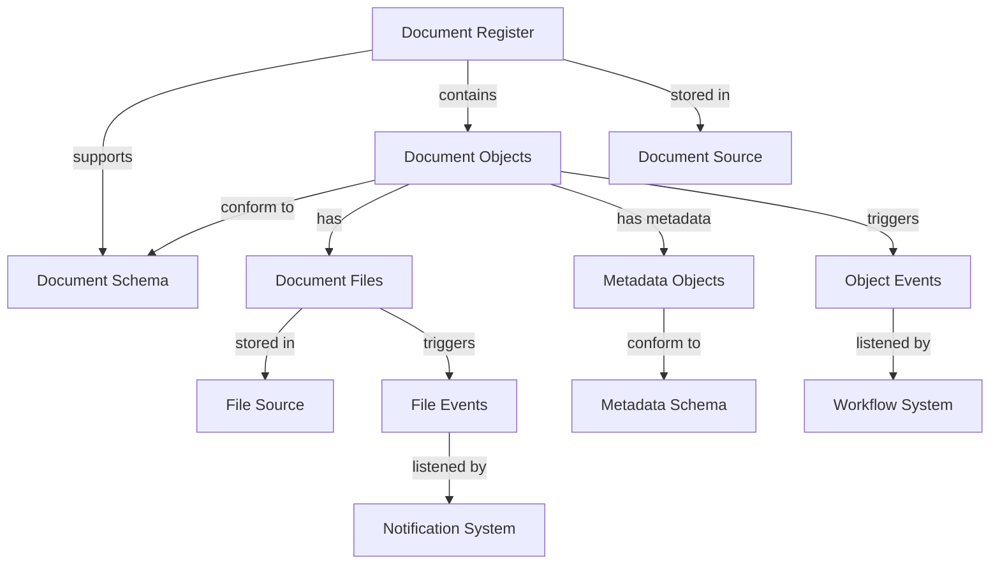
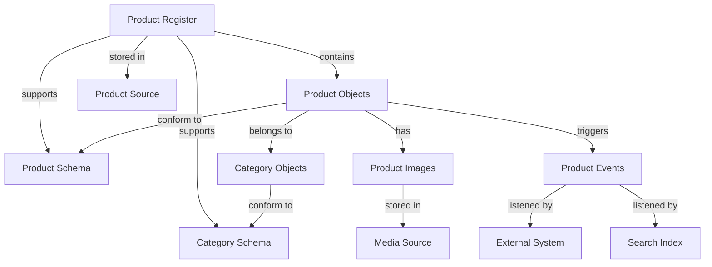

import ApiSchema from '@theme/ApiSchema';
import Tabs from '@theme/Tabs';
import TabItem from '@theme/TabItem';
import Mermaid from '@theme/Mermaid';


# Core Features

One of the most powerful aspects of Open Register is how its core concepts interact with each other. Understanding these relationships is key to effectively designing and using the system.

## Relationship Overview

The core entities in Open Register - Registers, Schemas, Objects, Files, Sources, and Events - form an interconnected system:

<Mermaid
  value={`
graph TD
    Register[Registers] -->|contain| Object[Objects]
    Register -->|support| Schema[Schemas]
    Object -->|conform to| Schema
    Register -->|stored in| Source[Sources]
    Object -->|stored in| Source
    Schema -->|stored in| Source
    Object -->|relate to| Object
    Object -->|has| File[Files]
    File -->|stored in| Source
    Schema -->|defines| File
    Object -->|trigger| Event[Events]
    Register -->|trigger| Event
    Schema -->|trigger| Event
    File -->|trigger| Event`}
/>

## Register-Schema Relationship

Registers and schemas have a many-to-many relationship:

### How Registers Use Schemas

- A register defines which schemas it supports through its `schemas` property
- This property contains an array of schema IDs
- Only objects conforming to one of these schemas can be stored in the register

### Example

```json
// Register definition
{
  "id": "person-register",
  "title": "Person Register",
  "schemas": ["person", "address", "contact-details"],
  // other properties...
}
```

This register supports three schemas: "person", "address", and "contact-details".

### Design Considerations

When designing the relationship between registers and schemas:

1. **Group Related Schemas**: Include schemas that logically belong together in the same register
2. **Consider Access Control**: Schemas in the same register often share similar access patterns
3. **Balance Specificity and Flexibility**: Too many schemas can make a register unfocused, while too few can limit its usefulness

## Register-Object Relationship

Registers and objects have a one-to-many relationship:

### How Registers Contain Objects

- Each object belongs to exactly one register (specified by its `register` property)
- A register can contain many objects
- Objects in a register must conform to one of the register's supported schemas

### Example

```json
// Object definition
{
  "id": "person-12345",
  "register": "person-register",
  "schema": "person",
  // other properties...
}
```

This object belongs to the "person-register" and conforms to the "person" schema.

### Design Considerations

When designing the relationship between registers and objects:

1. **Logical Grouping**: Group objects that are commonly accessed together in the same register
2. **Performance**: Consider query patterns when deciding which objects go in which register
3. **Scalability**: Plan for how registers will grow over time

## Schema-Object Relationship

Schemas and objects have a one-to-many relationship:

### How Schemas Define Objects

- Each object conforms to exactly one schema (specified by its `schema` property)
- A schema can be used by many objects
- The schema defines the structure, validation rules, and relationships for the object

### Example

```json
// Schema definition
{
  "id": "person",
  "properties": {
    "firstName": { "type": "string" },
    "lastName": { "type": "string" },
    // other properties...
  }
}

// Object data conforming to the schema
{
  "firstName": "John",
  "lastName": "Doe"
}
```

### Schema Evolution and Objects

When schemas evolve, it affects objects:

1. **Minor Changes**: Adding optional fields or relaxing constraints typically doesn't affect existing objects
2. **Major Changes**: Adding required fields or changing field types may require updating existing objects
3. **Versioning**: Schema versioning helps manage these changes over time

## Object-File Relationship

Objects and files have a one-to-many relationship:

### How Objects Contain Files

- Files are attached to objects through the object's `files` property
- An object can have multiple files
- Files inherit permissions from their parent object

### Example

```json
// Object with files
{
  "id": "contract-12345",
  "files": [
    {
      "id": "file-67890",
      "name": "contract.pdf",
      "contentType": "application/pdf",
      "size": 1245678,
      "url": "/api/files/file-67890"
    },
    {
      "id": "file-54321",
      "name": "signature.jpg",
      "contentType": "image/jpeg",
      "size": 45678,
      "url": "/api/files/file-54321"
    }
  ],
  // other properties...
}
```

### Design Considerations

When designing the relationship between objects and files:

1. **File Organization**: Consider how files should be organized and named
2. **Metadata**: Define what metadata should be stored with files
3. **Versioning**: Determine how file versions should be managed
4. **Access Control**: Plan how file permissions should be handled

## Schema-File Relationship

Schemas can define expectations for file attachments:

### How Schemas Define Files

- Schemas can specify file properties like allowed types and maximum sizes
- Schemas can define required file attachments
- Schemas can specify validation rules for file metadata

### Example

```json
// Schema with file definitions
{
  "id": "contract",
  "properties": {
    "title": { "type": "string" },
    "files": {
      "type": "array",
      "items": {
        "type": "object",
        "properties": {
          "type": {
            "type": "string",
            "enum": ["contract", "signature", "attachment"]
          },
          "contentType": {
            "type": "string",
            "pattern": "^application/pdf|image/jpeg|image/png$"
          },
          "maxSize": {
            "type": "integer",
            "maximum": 10485760 // 10MB
          }
        }
      },
      "minItems": 1
    }
  },
  "required": ["title", "files"]
}
```

### Design Considerations

When designing the relationship between schemas and files:

1. **Validation Rules**: Define appropriate validation rules for files
2. **Required Files**: Determine which files should be required
3. **File Types**: Specify allowed file types and formats
4. **Size Limits**: Set appropriate size limits for different file types

## Entity-Event Relationships

Events are triggered by and relate to other entities:

### How Entities Trigger Events

- Changes to objects, registers, schemas, and files trigger events
- Events carry data about the entity and the change
- Events enable other components to react to changes

### Example

```php
// Event triggered by object creation
class ObjectCreatedEvent extends Event {
    private ObjectEntity $object;

    public function __construct(ObjectEntity $object) {
        parent::__construct();
        $this->object = $object;
    }

    public function getObject(): ObjectEntity {
        return $this->object;
    }
}
```

### Design Considerations

When designing the relationship between entities and events:

1. **Event Granularity**: Determine the right level of detail for events
2. **Event Data**: Include enough data in events for listeners to be useful
3. **Event Naming**: Use consistent naming conventions for events
4. **Event Documentation**: Document when events are triggered and what data they contain

## Source Relationships

Sources have relationships with all other entities:

### How Sources Store Data

- Sources provide the storage backend for registers, schemas, objects, and files
- Different entities can use different sources
- Source configuration affects performance, scalability, and reliability

### Example

```json
// Register referencing a source
{
  "id": "person-register",
  "source": "primary-source",
  // other properties...
}

// Source definition
{
  "id": "primary-source",
  "databaseUrl": "mongodb://localhost:27017/openregister",
  "type": "mongodb",
  // other properties...
}
```

### Design Considerations

When designing source relationships:

1. **Performance**: Match source types to access patterns
2. **Scalability**: Plan for growth in data volume
3. **Reliability**: Consider redundancy and backup requirements
4. **Security**: Isolate sensitive data in separate sources if needed

## Object-Object Relationships

Objects can have relationships with other objects:

### How Objects Relate to Each Other

- Objects can reference other objects through their `relations` property
- These relationships can cross register boundaries
- Relationships have a type that defines their meaning

### Example

```json
// Object with relationships
{
  "id": "person-12345",
  "relations": [
    {
      "type": "spouse",
      "target": "person-67890"
    },
    {
      "type": "employer",
      "target": "organization-54321"
    }
  ],
  // other properties...
}
```

### Types of Relationships

1. **Hierarchical**: Parent-child relationships (e.g., department-employee)
2. **Associative**: Peer relationships (e.g., spouse, colleague)
3. **Compositional**: Whole-part relationships (e.g., product-component)
4. **Referential**: Simple references (e.g., author of a document)

### Design Considerations

When designing object relationships:

1. **Relationship Types**: Define clear relationship types with specific meanings
2. **Bidirectionality**: Consider whether relationships need to be navigable in both directions
3. **Integrity**: Maintain referential integrity when objects are deleted
4. **Performance**: Consider query patterns when designing relationships

## Practical Examples

### Example 1: Document Management System with Events



### Example 2: Product Catalog System with Integration



## Best Practices for Managing Relationships

1. **Document Relationships**: Clearly document the relationships between entities
2. **Consistent Naming**: Use consistent naming conventions for relationship types
3. **Validate Relationships**: Ensure relationships reference valid entities
4. **Consider Performance**: Design relationships with query performance in mind
5. **Plan for Evolution**: Design relationships that can evolve over time
6. **Maintain Integrity**: Implement processes to maintain referential integrity
7. **File Organization**: Develop clear strategies for organizing and managing files
8. **Event Design**: Design events to carry sufficient context for listeners
9. **Listener Independence**: Ensure event listeners can operate independently

## Conclusion

The relationships between Open Register's core concepts create a flexible yet structured system for managing data. By understanding these relationships, you can design effective data models that leverage the full power of the system while maintaining data quality and performance. 