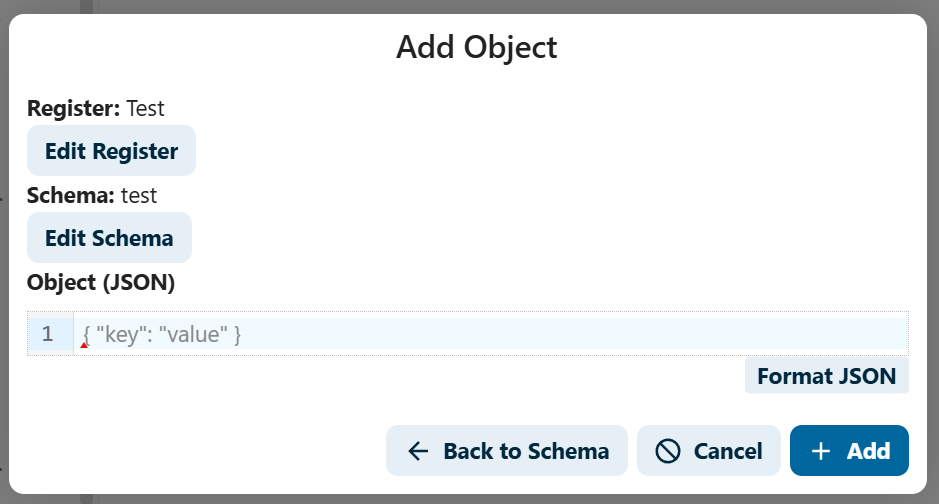
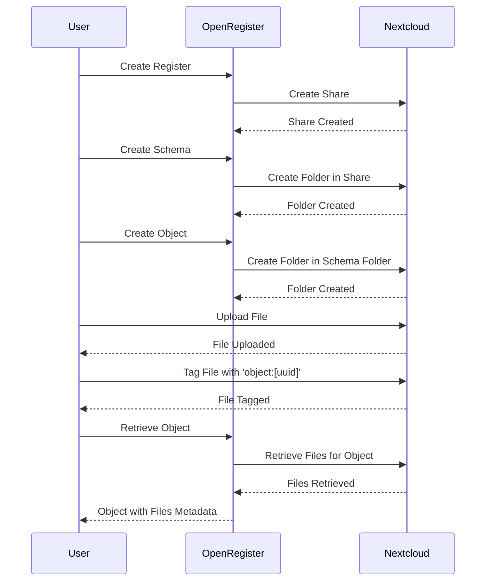

import ApiSchema from '@theme/ApiSchema';
import Tabs from '@theme/Tabs';
import TabItem from '@theme/TabItem';

# Objects

## What is an Object?

In Open Register, an **Object** is an instance of data that conforms to a specific schema and is stored in a register. Objects are the actual content of your data management system - they represent real-world entities like people, products, locations, or events.

Each object:
- Has a unique identifier
- Conforms to a schema that defines its structure
- Belongs to a register that organizes related objects
- Can have relationships with other objects
- Can have attached files
- Maintains version history

## Object Structure

All objects are stored as object entities, or json objects holding both the metadata and data of the actual object. These object entities are available through the `objects api`. Object entities are a way of storing objects - they might be seen as an envelope for the actual object. When serialization happens the object is changed to the actual object (and the envelope moved to @self see [metadata](#metadata)).

<Tabs>
  <TabItem value="stored_object" label="Specifications" default>
    <ApiSchema id="open-register" example pointer="#/components/schemas/ObjectEntity" />
  </TabItem>
  <TabItem value="serialized_object" label="Serialized Object">
    <ApiSchema id="open-register" example pointer="#/components/schemas/SerializeEntity" />
  </TabItem>
</Tabs>

## Creating objects

### Creating Objects

To create an object in Open Register, you need to ensure that both the register and schema are in place. An object always refers to a specific register and conforms to a defined schema. 

Objects can be created using the 'POST /api/objects' endpoint. This endpoint allows you to submit a new object that adheres to the schema associated with the specified register.

Here is a brief overview of the steps to create an object:

1. **Ensure Register and Schema are in Place**:
   - Before creating an object, make sure that the register and schema you want to use are already created and available in the system.

2. **Prepare the Object Data**:
   - Structure your object data according to the schema defined for the register. This ensures that the object will be validated and stored correctly.

3. **Make the API Request**:
   - Use the 'POST /api/objects' endpoint to submit your object data. The request should include the necessary information to identify the register and conform to the schema.

For detailed information on the API endpoint and how to use it, please refer to the [API documentation for creating objects](https://openregisters.app/api#tag/objects/operation/createObject).

Right now objects can be added from the Objects menu item and then the "Add object option". Afhter selecting a Register and Schema an object can be added in pure json format




## Object Features

### Schema Validation

All objects are validated against their schema before being stored, ensuring data quality and consistency. You can read more about schema validation under [schema](#schema).

### Serialisation

In Open Register, objects or lists of objects can be serialized based on the header request. This means that all responses are available in both JSON and XML formats. The serialization format is determined by the `Accept` header in the request. 

For example:
- To receive the response in JSON format, set the `Accept` header to `application/json`.
- To receive the response in XML format, set the `Accept` header to `application/xml`.

This flexibility allows clients to choose the most suitable format for their needs, ensuring compatibility with various systems and applications.

### Metadata
Open Register keeps track of the metadata of objects, it always keeps track of the following fields whether or not they are part of the object. This data is stored in object entity but transferred to the @self property when the object is serialized.

<ApiSchema id="open-register" example pointer="#/components/schemas/@self" />

### Relationships
Object Relations enable the creation and management of connections between objects, supporting complex data structures and relationships.

The relations system provides:
- Multiple relationship types
- Bi-directional relationships
- Relationship metadata
- Integrity management

** Key Benefits **

1. **Data Organization**
   - Model complex relationships
   - Maintain data connections
   - Support hierarchical structures

2. **Data Integration**
   - Link related information
   - Create data networks
   - Support cross-referencing

3. **Process Management**
   - Track dependencies
   - Manage workflows
   - Support business processes

Objects can have relationships with other objects, creating a network of connected data. Relationships are stored in the `relations` property as an array where the keys are dot notations referring to properties in the object, and the values are references to external objects. References can be either an id, uuid, or URL to an extended object. In this way, the relationship metadata property forms a quick index of all the objects that an object is related to. For more information on dot notation, please refer to this [dot notation explanation](https://en.wikipedia.org/wiki/Dot_notation).

```json{
    {
    "@self": {
      "relations":{
        "user":"1",
        "user":"1",
      }
    }
  .... The actual object  
  }
```

### Extending
Data Extension allows you to automatically include related entities in API responses, reducing the need for multiple API calls and providing complete context in a single request. This is useful when you need to retrieve related data for a specific object or collection an lowers the number of API calls needed therby reducing the load on the server and improving performence client side.

The extend patern is based was orginally developed for the [Open Catalogi](https://opencatalogi.org) project and is now available in the ObjectStore API. Its baed on the extend functionality of [Zaak gericht werken](https://github.com/VNG-Realisatie/gemma-zaken) but brought in line with p[NLGov REST API Design Rules](https://logius-standaarden.github.io/API-Design-Rules/) by adding a _ prefix to the parameter

**Key Benefits of Extending**

1. **Efficiency**
   - Reduce the number of API calls
   - Minimize server load
   - Improve client-side performance

2. **Contextual Data**
   - Provide complete context in a single request
   - Include related entities automatically
   - Simplify data retrieval

3. **Flexibility**
   - Extend single or multiple properties
   - Support nested property extensions
   - Combine multiple extensions in one request

4. **Consistency**
   - Ensure consistent data representation
   - Maintain data integrity across related entities
   - Simplify data management and integration

5. **Scalability**
   - Handle complex data structures efficiently
   - Support large-scale data operations
   - Enhance overall system scalability


Extention patern is suported trough the objects api

Extend a single property:
- `?_extend=author` - Include full author object
- `?_extend=category` - Include full category object
- `?_extend=files` - Include file metadata

Extend nested properties:
- `?_extend=author.organization` - Include author with their organization
- `?_extend=department.employees` - Include department with all employees
- `?_extend=project.tasks.assignee` - Include project with tasks and their assignees

Combine multiple extensions:
- `?_extend=author,category,comments` - Include multiple related objects
- `?_extend=files,metadata,relations` - Include all related data
- `?_extend=all` - Include all possible relations on the root object

### revertedBy
The `revertedBy` property indicates which object this object was reverted from. This is part of Open Register's version control system, allowing you to track the history of object changes and reversions. For more details about how this works with schemas, see [Schema Relationships](Features/schemas.md#schema-relationships).

### inversedBy
The `inversedBy` property represents inverse relationships between objects. It's used to maintain bidirectional relationships, where changes in one object automatically reflect in related objects. For more information about inverse relationships and how they work with schemas, see [Schema Relationships](Features/schemas.md#schema-relationships).

### Locking

Locking is a mechanism used to prevent concurrent editing of objects, ensuring data integrity in multi-user environments. A user (or a process on behalf of a user) might lock an object to prevent other users or processes from performing changes or deletions. This is particularly useful in scenarios such as:

- When a user is editing an object in a form, and you want to prevent use collisions.
- For BPMN processes that might take some time and cannot have their underlying data altered. However, keep in mind that for the latter example, a BPMN process could also use a specific version of an object and might run into trouble if it tries to update it later.

Locks are by default created for five minutes but can be created for any duration by supplying the duration period. Locks can be extended, but only by the user that created the lock. Locks can also be removed, but only by the user that created the lock. Locks are automatically removed if the user that created the lock performs an update or delete operation.

**Key Benefits**

1. **Data Integrity**
   - Prevent concurrent modifications
   - Avoid data conflicts
   - Maintain consistency

2. **Process Management**
   - Support long-running operations
   - Coordinate multi-step updates
   - Manage workflow dependencies

3. **User Coordination**
   - Clear ownership indication
   - Transparent lock status
   - Managed access control

The Lock object is a crucial component in Open Register's locking mechanism. It is used to manage and enforce locks on objects, ensuring data integrity and preventing concurrent modifications. The Lock object contains information about the lock, such as the user who created it, the duration of the lock, and the timestamp when the lock was created.

<ApiSchema id="open-register" example pointer="#/components/schemas/Lock" />

### File Attachments

File Attachments enable objects to incorporate and manage associated files and documents seamlessly. Open Register utilizes Nextcloud's advanced file storage capabilities to offer a comprehensive and secure file management system. By integrating with Nextcloud's established infrastructure, Open Register benefits from various file handling features, including:

- Secure file storage and encryption
- File versioning and history
- Collaborative features such as sharing and commenting
- Preview generation for supported file types
- Automated virus scanning
- Support for flexible storage backends

Upon the creation of a register in Open Register, a corresponding share is automatically established in Nextcloud. Subsequently, when a schema is created, a folder is generated within that share. As objects are created, folders are established (using the UUID of the object) within the schema's folder. This structure ensures that each object has a dedicated folder, facilitating a straightforward and intuitive method for associating files with objects.

Alternatively, users can associate existing files with an object by utilizing the Nextcloud file system and tagging the file with 'object:[uuid]', where '[uuid]' represents the object's UUID. In both scenarios, there is no direct relationship between the file and a property within the object. However, the files are accessible through the object API, as file objects are included in the object metadata under the files array.

For more detailed information on file management and integration, please refer to the [Files Documentation](Features/files.md).

<ApiSchema id="open-register" example pointer="#/components/schemas/File" />

### Soft Deleting

Open Register implements a soft deletion strategy for objects, ensuring data can be recovered and maintaining referential integrity.

**Overview**

The deletion system provides:
- Soft deletion of objects
- Retention of relationships
- Configurable retention periods
- Recovery capabilities
- Audit trail preservation

1. Objects are never immediately deleted from the database
2. Deletion sets the 'deleted' timestamp and related metadata
3. Deleted objects are excluded from normal queries
4. Relations to deleted objects are preserved
5. Files linked to deleted objects are moved to a trash folder
6. Deleted objects can be restored until purge date
7. Objects are only permanently deleted after retention period



**Key Benefits**

1. **Data Safety**
   - Prevent accidental data loss
   - Maintain data relationships
   - Support data recovery
   - Preserve audit history

2. **Compliance**
   - Meet retention requirements
   - Support legal holds
   - Track deletion reasons
   - Document deletion process

3. **Management**
   - Flexible retention policies
   - Controlled purge process
   - Recovery options
   - Clean data lifecycle

<ApiSchema id="open-register" example pointer="#/components/schemas/Deletion" />

### Version History

Open Register maintains a complete history of changes to objects, allowing you to track modifications over time and revert to previous versions if needed. This version history powers the [Time Travel](#time-travel) feature, which enables you to:

- View an object as it existed at any point in time
- Compare different versions to see what changed
- Restore objects to previous states
- Analyze the evolution of data over time


### Time Travel

Time Travel in Open Register allows you to view and restore objects to any previous state in their history. This powerful feature enables data recovery, audit compliance, and historical analysis.


### Retrieving a Specific Version

In Open Register, every change to an object results in a new version, which is recorded in the audit trail. This allows you to get an overview of all versions of an object by examining its audit trail. Each entry in the audit trail corresponds to a specific version of the object, providing a detailed history of changes over time.

To retrieve a specific version of an object directly from the API, you can use the [API documentation for retrieving a specific object version](https://openregisters.app/api#tag/objects/operation/getObjectVersion).

### Comparing Versions (Planned Feature)

:::info

This feature is currently a planned feature and is not yet available. We are working on implementing it in future releases.

:::


You can compare two versions of an object to see what changed:

```
GET /api/objects/{id}/compare?version1=1.0&version2=1.2
```

Example response:

```json
{
  "id": "person-12345",
  "changes": {
    "lastName": {
      "old": "Doe",
      "new": "Smith-Johnson"
    },
    "email": {
      "old": "john.doe@example.com",
      "new": "jane.johnson@example.com"
    },
    "address": {
      "old": {
        "street": "123 Main St",
        "city": "Anytown",
        "postalCode": "12345",
        "country": "USA"
      },
      "new": {
        "street": "789 Pine St",
        "city": "Newtown",
        "postalCode": "54321",
        "country": "USA"
      }
    }
  }
}
```

### Restoring Previous Versions

You can restore an object to a previous version:

```json
POST /api/objects/{id}/restore
{
  "version": "1.1"
}
```

Or restore an object as it existed at a specific point in time:

```json
POST /api/objects/{id}/restore
{
  "timestamp": "2023-03-10T09:45:00Z"
}
```

### Audit Trails

Audit trails provide a complete history of all changes made to objects in Open Register. This feature ensures transparency and accountability by tracking who made what changes and when. The implementation follows the [GEMMA Processing Logging standard](https://vng-realisatie.github.io/gemma-verwerkingenlogging/gegevensmodel/basisterminologie.html). Open Register maintains immutable audit trails for objects, ensuring a permanent and unalterable record of changes. Audit trails track who made changes, when they were made, and what was changed. This feature is crucial for maintaining data integrity, security, and compliance. For detailed information on the API endpoint and how to use it, please refer to the [API documentation for getting object audit trails](https://openregisters.app/api#tag/objects/operation/getObjectAuditTrails).

The audit trail system automatically records:
- All modifications to objects
- Individual object reads (but not collection reads)
- Who made the changes
- When changes occurred
- What specific data was changed
- The reason for changes (when provided)
- Processing activities

## Read Action Logging

The system only logs read actions when accessing individual objects (e.g., GET /api/objects/123). Collection reads and search operations (e.g., GET /api/objects?name=test) are intentionally not logged for several important reasons:

1. **Performance Impact**
   - Collection reads can return hundreds or thousands of objects
   - Logging each object view would create massive amounts of audit data
   - Database performance would degrade significantly

2. **Storage Concerns**
   - The audit log would grow exponentially
   - Storage costs would increase dramatically
   - Valuable audit data would be diluted with less meaningful entries

3. **Meaningful Tracking**
   - Individual object reads indicate specific interest in that object
   - Collection reads are often exploratory or part of routine operations
   - Focus on logging deliberate access to specific objects
   
<ApiSchema id="open-register" example   pointer="#/components/schemas/AuditTrail" />
