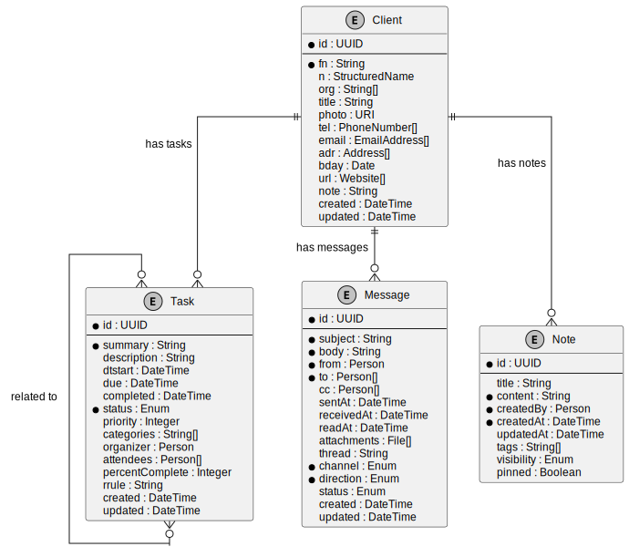

import Tabs from '@theme/Tabs';
import TabItem from '@theme/TabItem';

# European Client Register

## Project Introduction

The European Client Register is a collaborative initiative between Open Register, Nextcloud, and government agencies from France and Germany. This project aims to transform European standards and definitions into a practical, interoperable register that can be used by governments throughout Europe to store and manage client data in a standardized way.

### European Collaboration

This project represents a cross-border effort to address common challenges in public administration:

- **Nextcloud** contributes expertise in secure, open-source data storage and collaboration
- **French government agencies** provide insights from their "État Plateforme" (State as a Platform) initiative
- **German government agencies** share experience from their "Digitale Verwaltung" (Digital Administration) program
- **Open Register** offers the technical framework for implementing standardized registers

Together, we're working to create a reference implementation that demonstrates how European standards can be applied in practice to create interoperable, privacy-respecting client data management systems.

### Common Ground Integration

This project aligns with the [Common Ground](https://commonground.nl/) principles developed in the Netherlands, which promote:

1. **Component-based architecture** - Building modular, reusable components
2. **Data at the source** - Storing data once and using it multiple times
3. **Standard APIs** - Using standardized interfaces for data exchange
4. **Open standards** - Adopting open standards for interoperability

The Client Register serves as a key building block in the Common Ground ecosystem, providing a standardized way to store and access client information across different government services and applications.

### Connectivity through Standardization

By implementing European standards in a practical register, this project contributes to the broader goal of "connectivity through standardization" - enabling different systems to work together seamlessly through shared standards and interfaces.

Key standardization efforts we're building upon include:

- **European Interoperability Framework (EIF)** - Providing guidelines for public administrations on how to improve interoperability
- **ISA² Programme** - Developing digital solutions that enable public administrations to provide interoperable services
- **Single Digital Gateway Regulation** - Establishing a single digital gateway to provide access to information and procedures across the EU
- **Once-Only Principle** - Ensuring citizens and businesses provide data only once to public administrations

## Purpose and Scope

This document presents research and implementation guidance for building client registers based on European standards. It aims to:

1. **Identify and analyze relevant standards** for client data management
2. **Compare different approaches** to implementing these standards
3. **Provide practical guidance** for implementing a standards-compliant client register
4. **Demonstrate interoperability** with existing systems and standards

The resulting client register design serves as a reference implementation that can be adapted by government agencies across Europe to meet their specific needs while maintaining interoperability with other systems.

## References and Standards

This research and implementation guide draws upon the following standards and references:

### Core Standards
- [vCard Format Specification (RFC 6350)](https://datatracker.ietf.org/doc/html/rfc6350) - Contact information format
- [iCalendar Format (RFC 5545)](https://datatracker.ietf.org/doc/html/rfc5545) - Calendar and task data format
- [Internet Message Format (RFC 5322)](https://datatracker.ietf.org/doc/html/rfc5322) - Email message format
- [JSON Meta Application Protocol (JMAP)](https://jmap.io/) - Modern email and object protocol

### Semantic Web Standards
- [Schema.org Person](https://schema.org/Person) - Person entity definition
- [Schema.org Organization](https://schema.org/Organization) - Organization entity definition
- [Schema.org PlanAction](https://schema.org/PlanAction) - Task/action representation
- [Schema.org Message](https://schema.org/Message) - Message representation
- [Schema.org Comment](https://schema.org/Comment) - Note/comment representation

### Business Standards
- [Universal Business Language (UBL) 2.1](http://docs.oasis-open.org/ubl/os-UBL-2.1/UBL-2.1.html) - Business document schemas
- [UBL Party Schema](http://docs.oasis-open.org/ubl/os-UBL-2.1/UBL-2.1.html#S-PARTY) - Business party representation

### EIDAS Regulation and Core Vocabularies

The [eIDAS Regulation](https://digital-strategy.ec.europa.eu/en/policies/eidas-regulation) (Electronic Identification, Authentication and Trust Services) establishes a legal framework for electronic identification and trust services across EU member states. While the regulation itself doesn't mandate specific data models, implementations that support cross-border identification should align with the EU Core Vocabularies.

The European Commission officially recommends the [Core Vocabularies](https://joinup.ec.europa.eu/collection/semantic-interoperability-community-semic/solution/e-government-core-vocabularies) for public administrations and entities that interact with them. In many EU-funded projects and cross-border services, these vocabularies are effectively mandatory.

**Key references:**
- [eIDAS Regulation (EU) No 910/2014](https://eur-lex.europa.eu/legal-content/EN/TXT/?uri=uriserv:OJ.L_.2014.257.01.0073.01.ENG)
- [ISA² Programme Decision](https://eur-lex.europa.eu/legal-content/EN/TXT/?uri=CELEX%3A32015D2240) - Establishing the program that developed Core Vocabularies
- [European Interoperability Framework](https://ec.europa.eu/isa2/eif_en) - Recommends Core Vocabularies

###  Mandatory Standards in European Context

**Key references:**
- [EU Core Vocabularies](https://joinup.ec.europa.eu/collection/semantic-interoperability-community-semic/solution/e-government-core-vocabularies) - Simplified data models
- [Core Person Vocabulary](https://joinup.ec.europa.eu/collection/semantic-interoperability-community-semic/solution/core-person-vocabulary) - Person data model
- [Core Business Vocabulary](https://joinup.ec.europa.eu/collection/semantic-interoperability-community-semic/solution/core-business-vocabulary) - Business data model
- [Core Location Vocabulary](https://joinup.ec.europa.eu/collection/semantic-interoperability-community-semic/solution/core-location-vocabulary) - Location data model
- [Core Public Organization Vocabulary](https://joinup.ec.europa.eu/collection/semantic-interoperability-community-semic/solution/core-public-organisation-vocabulary) - Public organization model
- [DCAT Application Profile](https://joinup.ec.europa.eu/collection/semantic-interoperability-community-semic/solution/dcat-application-profile-data-portals-europe) - Metadata specification
- [DCAT-AP-NL on Forum Standaardisatie](https://www.forumstandaardisatie.nl/open-standaarden/dcat-ap-nl)
- [DCAT-AP-NL Documentation](https://dcat-ap-nl.readthedocs.io/en/latest/)

### Commercial CRM Systems
- [Salesforce API Documentation](https://developer.salesforce.com/docs/atlas.en-us.api.meta/api/data_model.htm) - Salesforce data model
- [Microsoft Dynamics 365 Entity Reference](https://learn.microsoft.com/en-us/dynamics365/customerengagement/on-premises/developer/entities/account) - Dynamics 365 entities
- [Exact Online REST API](https://start.exactonline.nl/docs/HlpRestAPIResources.aspx?SourceAction=10) - Exact Online resources

### Dutch standards and guidelines

The [Nederlandse API Strategie](https://docs.geostandaarden.nl/api/API-Strategie/) (Dutch API Strategy) provides guidelines for REST APIs in the Dutch public sector. Our client register design aligns with these guidelines:

- Use of JSON as the primary format
- Consistent naming conventions
- Support for filtering, sorting, and pagination
- Proper error handling

**Key references:**
- [NL API Strategy on Forum Standaardisatie](https://www.forumstandaardisatie.nl/open-standaarden/rest-api-design-rules)
- [API Design Rules](https://publicatie.centrumvoorstandaarden.nl/api/adr/)
- [Forum Standaardisatie - UBL 2.1](https://www.forumstandaardisatie.nl/open-standaarden/ubl) - Official listing as a mandatory standard
- [NLCIUS](https://www.nen.nl/en/nlcius-1-0-1) - Dutch implementation of UBL for e-invoicing
- [Logius Digikoppeling](https://www.logius.nl/diensten/digikoppeling) - Dutch government service exchange that uses UBL

## Introduction

This tutorial walks through creating a comprehensive client management system using Open Register, with APIs for client information, tasks, messages, and notes.

## Overvieuw Relationships Between Entities

All these entities are interconnected in our client management system:

The diagram above shows how:

1. **Clients** are the central entity
2. **Tasks** are associated with clients (one client can have many tasks)
3. **Messages** are linked to clients (communication history)
4. **Notes** are attached to clients (observations and information)
5. Tasks can be related to other tasks (for dependencies or subtasks)

In the next sections, we'll define the API endpoints for each entity and show how to implement them in Open Register.

## Client Object

For our client information, we'll use the European Core Vocabularies (Core Person and Core Business) as our primary foundation, while ensuring compatibility with other standards including vCard, Schema.org, and commercial CRM systems.

### Historical Context

The vCard standard (RFC 6350) represents one of the first industry-wide attempts to standardize person and organization information. Developed in the 1990s and still widely used today, vCard remains the dominant format for exchanging contact information between devices and applications, particularly in mobile phones, email clients, and contact management systems.

While vCard provides an excellent foundation for basic contact exchange, the European Core Vocabularies offer a more comprehensive approach specifically designed for government and business contexts, with stronger support for official identifiers, multilingual information, and regulatory compliance.

### Standard Comparison

While using EU Core Vocabularies as our primary standard, we maintain compatibility with other major person/client/organization standards:

<Tabs>
  <TabItem value="eu-core" label="EU Core Vocabularies">

**EU Standards**
- [Core Person Vocabulary](https://joinup.ec.europa.eu/collection/semantic-interoperability-community-semic/solution/core-person-vocabulary) - Person data model
- [Core Business Vocabulary](https://joinup.ec.europa.eu/collection/semantic-interoperability-community-semic/solution/core-business-vocabulary) - Business data model
- [Core Public Organization Vocabulary](https://joinup.ec.europa.eu/collection/semantic-interoperability-community-semic/solution/core-public-organisation-vocabulary) - Public organization model

**Strengths**
- Official EU standard
- Strong identifier support  
- Multilingual by design
- Public sector alignment
- Regulatory compliance

**Limitations**
- Less known outside EU
- Fewer implementations
- More complex structure 
- Limited consumer support

**Best Used For**
- Government systems
- Cross-border exchange
- Official registrations
- Public procurement
- Regulatory reporting

</TabItem>
<TabItem value="vcard" label="vCard (RFC 6350)">

**Contact Standards**
- [vCard (RFC 6350)](https://datatracker.ietf.org/doc/html/rfc6350) - Contact information exchange
- [jCard (RFC 7095)](https://datatracker.ietf.org/doc/html/rfc7095) - JSON format for vCard
- [xCard (RFC 6351)](https://datatracker.ietf.org/doc/html/rfc6351) - XML format for vCard

**Strengths**
- Widespread adoption
- Simple structure
- Device compatibility 
- Email integration
- Consumer familiarity

**Limitations**
- Limited business fields
- Weak identifier support
- Basic multilingual support
- Limited relationship modeling

**Best Used For**
- Contact exchange
- Mobile devices
- Email systems
- Personal contacts
- Legacy integration

</TabItem>
<TabItem value="schema" label="Schema.org">

**Schema.org Standards**
- [Schema.org Person](https://schema.org/Person) - Person entity definition
- [Schema.org Organization](https://schema.org/Organization) - Organization entity definition
- [Schema.org LocalBusiness](https://schema.org/LocalBusiness) - Local business definition

**Strengths**
- Web search optimization
- Rich property set
- Linked data support
- Major search engine backing
- Growing adoption

**Limitations**
- Web-centric design
- Less formal validation
- Evolving specifications
- Limited official status

**Best Used For**
- Web content
- SEO optimization
- Knowledge graphs
- Public directories
- Semantic web applications

</TabItem>
<TabItem value="ubl" label="UBL">

**UBL Standards**
- [UBL Party Schema](http://docs.oasis-open.org/ubl/os-UBL-2.1/UBL-2.1.html#S-PARTY) - Party/organization model
- [UBL Person Schema](http://docs.oasis-open.org/ubl/os-UBL-2.1/UBL-2.1.html#S-PERSON) - Person model
- [UBL Address Schema](http://docs.oasis-open.org/ubl/os-UBL-2.1/UBL-2.1.html#S-ADDRESS) - Address model
- [UBL Contact Schema](http://docs.oasis-open.org/ubl/os-UBL-2.1/UBL-2.1.html#S-CONTACT) - Contact information model

**Strengths**
- Business document focus
- Procurement support
- Legal entity details
- International standard
- XML validation

**Limitations**
- Complex structure
- Verbose format
- Business-only focus
- Limited personal details

**Best Used For**
- E-procurement
- Business documents
- Supply chain
- E-invoicing
- Formal business exchange

</TabItem>
<TabItem value="salesforce" label="Commercial CRM">

**Commercial CRM Standards**
- [Salesforce Account Object](https://developer.salesforce.com/docs/atlas.en-us.object_reference.meta/object_reference/sforce_api_objects_account.htm) - Account/organization model
- [Microsoft Dynamics Account Entity](https://learn.microsoft.com/en-us/dynamics365/customerengagement/on-premises/developer/entities/account) - Account/organization model
- [Exact Online Account API](https://start.exactonline.nl/docs/HlpRestAPIResources.aspx?SourceAction=10) - Account/organization model

**Commercial CRM Comparison**

**Salesforce**
- **Strengths**: Business process integration, sales/marketing features, extensive customization, industry solutions, ecosystem support
- **Limitations**: Proprietary format, license requirements, complex data model, vendor lock-in
- **Best Used For**: CRM processes, sales automation, marketing campaigns, customer service, business intelligence

**Microsoft Dynamics**
- **Strengths**: Microsoft ecosystem integration, business process support, Office 365 integration, workflow automation, enterprise features
- **Limitations**: Proprietary format, license requirements, Microsoft-centric, complex customization
- **Best Used For**: Microsoft environments, ERP integration, Office integration, enterprise scenarios, complex business processes

**Exact Online**
- **Strengths**: Financial integration, European tax compliance, accounting features, SMB focus, Dutch/EU market alignment
- **Limitations**: Proprietary format, limited global presence, finance-centric model, less extensible
- **Best Used For**: Financial administration, European businesses, accounting integration, SMB operations, Dutch/EU compliance

</TabItem>
</Tabs>

### Property Comparison

The following table compares properties across all relevant standards:

| EU Core Property | vCard | Schema.org | UBL | Salesforce | Dynamics 365 | Exact Online | Description |
|------------------|-------|------------|-----|------------|--------------|--------------|-------------|
| **Person Properties** |
| identifier | UID | identifier | ID | Id | accountid | ID | Unique identifier |
| fullName | FN | name | Name | Name | name | Name | Full name |
| givenName | N (part) | givenName | FirstName | FirstName | firstname | FirstName | First name |
| familyName | N (part) | familyName | FamilyName | LastName | lastname | LastName | Last name |
| alternativeName | NICKNAME | alternateName | - | - | - | SearchCode | Alternative name |
| gender | GENDER | gender | GenderCode | - | gendercode | Gender | Gender |
| birthDate | BDAY | birthDate | BirthDate | Birthdate | birthdate | DateOfBirth | Birth date |
| birthPlace | - | birthPlace | - | - | birthdate_city | - | Place of birth |
| deathDate | - | deathDate | - | - | - | - | Date of death |
| citizenship | - | nationality | CitizenshipCountry | - | - | - | Citizenship |
| residency | - | - | ResidenceAddress | - | - | - | Country of residence |
| jurisdiction | - | - | JurisdictionRegion | - | - | - | Legal jurisdiction |
| **Organization Properties** |
| legalName | ORG | legalName | RegistrationName | Name | name | Name | Official name |
| alternativeName | - | alternateName | TradingName | - | - | SearchCode | Trading name |
| companyActivity | - | - | IndustryClassificationCode | Industry | industrycode | SbiCode | Industry classification |
| companyStatus | - | - | CorporateRegistrationStatus | Status | statuscode | Status | Company status |
| companyType | - | - | CompanyLegalFormCode | - | businesstypecode | LegalForm | Legal form |
| foundingDate | - | foundingDate | RegistrationDate | - | - | EstablishedDate | Founding date |
| dissolutionDate | - | dissolutionDate | - | - | - | - | Dissolution date |
| **Contact Properties** |
| address | ADR | address | PostalAddress | Address | address1_* | Address | Physical address |
| email | EMAIL | email | ElectronicMail | Email | emailaddress1 | Email | Email address |
| telephone | TEL | telephone | Telephone | Phone | telephone1 | Phone | Phone number |
| faxNumber | - | faxNumber | Telefax | Fax | fax | Fax | Fax number |
| website | URL | url | WebsiteURI | Website | websiteurl | Website | Website |
| **Financial Properties** |
| vatNumber | - | vatID | PartyTaxScheme | - | - | VATNumber | VAT registration |
| taxReference | - | taxID | TaxReference | - | - | TaxReferenceNumber | Tax reference |
| bankAccount | - | - | FinancialAccount | - | - | BankAccount | Bank account |
| paymentTerms | - | - | PaymentTerms | - | - | PaymentTerms | Payment terms |
| creditLimit | - | - | - | - | creditlimit | CreditLimit | Credit limit |
| **Relationship Properties** |
| memberOf | - | memberOf | PartyMember | - | parentaccountid | Parent | Parent organization |
| hasMember | - | member | Party | - | - | - | Child organizations |
| contactPerson | AGENT | employee | Contact | Contact | primarycontactid | Contact | Primary contact |
| department | ORG (part) | department | Department | Department | - | - | Department |
| role | ROLE | roleName | RoleCode | - | - | - | Role in organization |
| **Metadata Properties** |
| source | SOURCE | - | - | LeadSource | - | - | Information source |
| dateCreated | - | dateCreated | CreationDate | CreatedDate | createdon | Created | Creation timestamp |
| dateModified | REV | dateModified | LastModificationDate | LastModifiedDate | modifiedon | Modified | Last update timestamp |
| creator | - | creator | Author | CreatedBy | createdby | Creator | Record creator |
| lastModifier | - | - | - | LastModifiedBy | modifiedby | Modifier | Last modifier |

### Our Hybrid Approach

Based on this analysis, our client register uses a hybrid approach that:

1. **Adopts the EU Core Vocabularies as the foundation**
   - Ensures compliance with European standards
   - Supports official identifiers and multilingual information
   - Aligns with public sector requirements

2. **Incorporates Schema.org properties**
   - Improves web discoverability
   - Uses widely recognized property names
   - Supports semantic web integration

3. **Maintains vCard compatibility**
   - Enables contact exchange with mobile devices
   - Supports email integration
   - Leverages existing implementations

4. **Adds commercial CRM extensions**
   - Supports business processes
   - Enables integration with existing systems
   - Provides practical functionality

This approach ensures that our client register is both standards-compliant and practically useful in real-world government and business environments.

