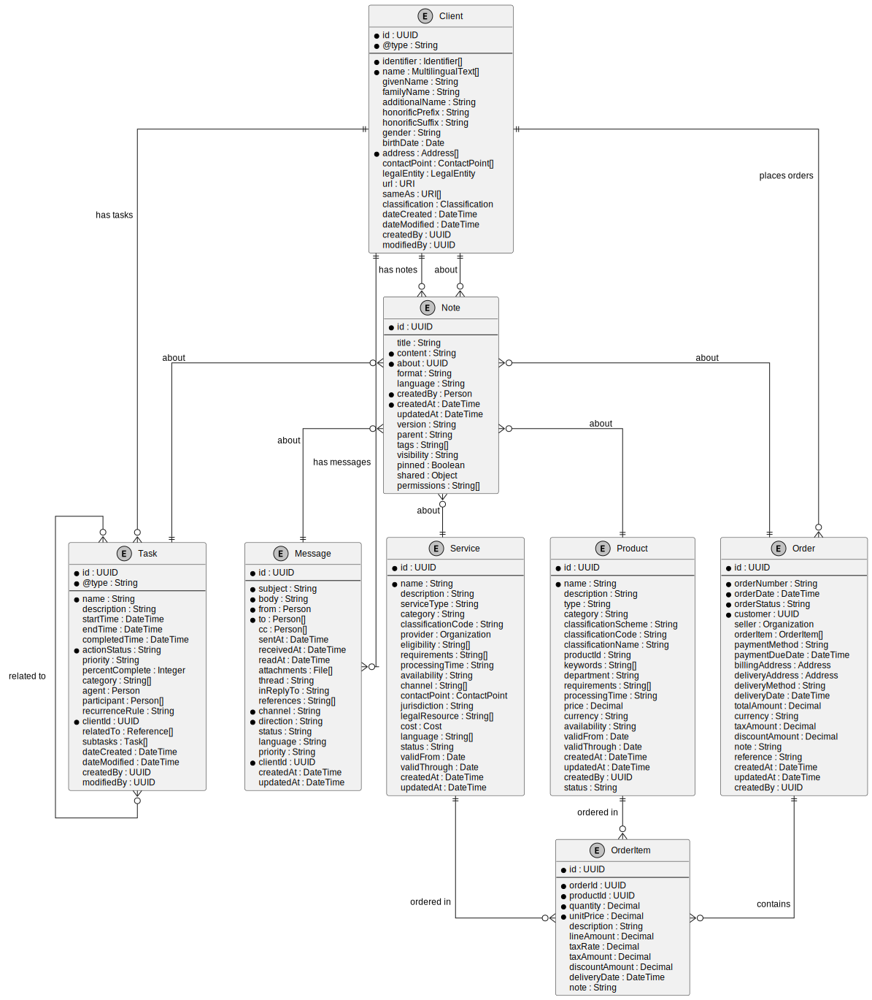

import Tabs from '@theme/Tabs';
import TabItem from '@theme/TabItem';

# European Client Register

## Project Introduction

The European Client Register is a collaborative initiative between Open Register, Nextcloud, and government agencies from France and Germany. This project aims to transform European standards and definitions into a practical, interoperable register that can be used by governments throughout Europe to store and manage client data in a standardized way.

### European Collaboration

This project represents a cross-border effort to address common challenges in public administration:

- **Nextcloud** contributes expertise in secure, open-source data storage and collaboration
- **French government agencies** provide insights from their "État Plateforme" (State as a Platform) initiative
- **German government agencies** share experience from their "Digitale Verwaltung" (Digital Administration) program
- **Open Register** offers the technical framework for implementing standardized registers

Together, we're working to create a reference implementation that demonstrates how European standards can be applied in practice to create interoperable, privacy-respecting client data management systems.

### Common Ground Integration

This project aligns with the [Common Ground](https://commonground.nl/) principles developed in the Netherlands, which promote:

1. **Component-based architecture** - Building modular, reusable components
2. **Data at the source** - Storing data once and using it multiple times
3. **Standard APIs** - Using standardized interfaces for data exchange
4. **Open standards** - Adopting open standards for interoperability

The Client Register serves as a key building block in the Common Ground ecosystem, providing a standardized way to store and access client information across different government services and applications.

### Connectivity through Standardization

By implementing European standards in a practical register, this project contributes to the broader goal of "connectivity through standardization" - enabling different systems to work together seamlessly through shared standards and interfaces.

Key standardization efforts we're building upon include:

- **European Interoperability Framework (EIF)** - Providing guidelines for public administrations on how to improve interoperability
- **ISA² Programme** - Developing digital solutions that enable public administrations to provide interoperable services
- **Single Digital Gateway Regulation** - Establishing a single digital gateway to provide access to information and procedures across the EU
- **Once-Only Principle** - Ensuring citizens and businesses provide data only once to public administrations

## Purpose and Scope

This document presents research and implementation guidance for building client registers based on European standards. It aims to:

1. **Identify and analyze relevant standards** for client data management
2. **Compare different approaches** to implementing these standards
3. **Provide practical guidance** for implementing a standards-compliant client register
4. **Demonstrate interoperability** with existing systems and standards

The resulting client register design serves as a reference implementation that can be adapted by government agencies across Europe to meet their specific needs while maintaining interoperability with other systems.

## References and Standards

This research and implementation guide draws upon the following standards and references:

### Core Standards
- [vCard Format Specification (RFC 6350)](https://datatracker.ietf.org/doc/html/rfc6350) - Contact information format
- [iCalendar Format (RFC 5545)](https://datatracker.ietf.org/doc/html/rfc5545) - Calendar and task data format
- [Internet Message Format (RFC 5322)](https://datatracker.ietf.org/doc/html/rfc5322) - Email message format
- [JSON Meta Application Protocol (JMAP)](https://jmap.io/) - Modern email and object protocol

### Semantic Web Standards
- [Schema.org Person](https://schema.org/Person) - Person entity definition
- [Schema.org Organization](https://schema.org/Organization) - Organization entity definition
- [Schema.org PlanAction](https://schema.org/PlanAction) - Task/action representation
- [Schema.org Message](https://schema.org/Message) - Message representation
- [Schema.org Comment](https://schema.org/Comment) - Note/comment representation

### Business Standards
- [Universal Business Language (UBL) 2.1](http://docs.oasis-open.org/ubl/os-UBL-2.1/UBL-2.1.html) - Business document schemas
- [UBL Party Schema](http://docs.oasis-open.org/ubl/os-UBL-2.1/UBL-2.1.html#S-PARTY) - Business party representation

### EIDAS Regulation and Core Vocabularies

The [eIDAS Regulation](https://digital-strategy.ec.europa.eu/en/policies/eidas-regulation) (Electronic Identification, Authentication and Trust Services) establishes a legal framework for electronic identification and trust services across EU member states. While the regulation itself doesn't mandate specific data models, implementations that support cross-border identification should align with the EU Core Vocabularies.

The European Commission officially recommends the [Core Vocabularies](https://joinup.ec.europa.eu/collection/semantic-interoperability-community-semic/solution/e-government-core-vocabularies) for public administrations and entities that interact with them. In many EU-funded projects and cross-border services, these vocabularies are effectively mandatory.

**Key references:**
- [eIDAS Regulation (EU) No 910/2014](https://eur-lex.europa.eu/legal-content/EN/TXT/?uri=uriserv:OJ.L_.2014.257.01.0073.01.ENG)
- [ISA² Programme Decision](https://eur-lex.europa.eu/legal-content/EN/TXT/?uri=CELEX%3A32015D2240) - Establishing the program that developed Core Vocabularies
- [European Interoperability Framework](https://ec.europa.eu/isa2/eif_en) - Recommends Core Vocabularies

###  Mandatory Standards in European Context

**Key references:**
- [EU Core Vocabularies](https://joinup.ec.europa.eu/collection/semantic-interoperability-community-semic/solution/e-government-core-vocabularies) - Simplified data models
- [Core Person Vocabulary](https://joinup.ec.europa.eu/collection/semantic-interoperability-community-semic/solution/core-person-vocabulary) - Person data model
- [Core Business Vocabulary](https://joinup.ec.europa.eu/collection/semantic-interoperability-community-semic/solution/core-business-vocabulary) - Business data model
- [Core Location Vocabulary](https://joinup.ec.europa.eu/collection/semantic-interoperability-community-semic/solution/core-location-vocabulary) - Location data model
- [Core Public Organization Vocabulary](https://joinup.ec.europa.eu/collection/semantic-interoperability-community-semic/solution/core-public-organisation-vocabulary) - Public organization model
- [DCAT Application Profile](https://joinup.ec.europa.eu/collection/semantic-interoperability-community-semic/solution/dcat-application-profile-data-portals-europe) - Metadata specification
- [DCAT-AP-NL on Forum Standaardisatie](https://www.forumstandaardisatie.nl/open-standaarden/dcat-ap-nl)
- [DCAT-AP-NL Documentation](https://dcat-ap-nl.readthedocs.io/en/latest/)

### Commercial CRM Systems
- [Salesforce API Documentation](https://developer.salesforce.com/docs/atlas.en-us.api.meta/api/data_model.htm) - Salesforce data model
- [Microsoft Dynamics 365 Entity Reference](https://learn.microsoft.com/en-us/dynamics365/customerengagement/on-premises/developer/entities/account) - Dynamics 365 entities
- [Exact Online REST API](https://start.exactonline.nl/docs/HlpRestAPIResources.aspx?SourceAction=10) - Exact Online resources

### Dutch standards and guidelines

The [Nederlandse API Strategie](https://docs.geostandaarden.nl/api/API-Strategie/) (Dutch API Strategy) provides guidelines for REST APIs in the Dutch public sector. Our client register design aligns with these guidelines:

- Use of JSON as the primary format
- Consistent naming conventions
- Support for filtering, sorting, and pagination
- Proper error handling

**Key references:**
- [NL API Strategy on Forum Standaardisatie](https://www.forumstandaardisatie.nl/open-standaarden/rest-api-design-rules)
- [API Design Rules](https://publicatie.centrumvoorstandaarden.nl/api/adr/)
- [Forum Standaardisatie - UBL 2.1](https://www.forumstandaardisatie.nl/open-standaarden/ubl) - Official listing as a mandatory standard
- [NLCIUS](https://www.nen.nl/en/nlcius-1-0-1) - Dutch implementation of UBL for e-invoicing
- [Logius Digikoppeling](https://www.logius.nl/diensten/digikoppeling) - Dutch government service exchange that uses UBL
- [Open Klant API](https://redocly.github.io/redoc/?url=https://raw.githubusercontent.com/maykinmedia/open-klant/2.5.0/src/openklant/components/klantinteracties/openapi.yaml) - Dutch standard for client interactions
- [Open Klant on GitHub](https://github.com/maykinmedia/open-klant) - Open source implementation of the Dutch client standard

## Regulatory and Standards Compliance

When implementing client registers in European contexts, it's important to understand that certain standards are not merely recommendations but regulatory requirements or officially endorsed standards that must be applied in specific scenarios.

### Validation Resources

To ensure compliance with these standards, the following validation resources are available:

- [EU Core Vocabularies Validator](https://www.itb.ec.europa.eu/shacl/any/upload) - Validates against Core Vocabularies using SHACL
- [UBL Validation Tool](https://validatie.stpe.nl/) - Dutch UBL validation service
- [Schema.org Validator](https://validator.schema.org/) - Validates Schema.org markup
- [DCAT-AP Validator](https://www.itb.ec.europa.eu/shacl/dcat-ap/upload) - Validates DCAT-AP compliance

By using these validation tools during implementation, you can ensure that your client register meets all applicable standards and regulatory requirements.

## API Specification

To complement our standards-based client register design, we've created a comprehensive OpenAPI Specification (OAS) document that defines the API endpoints, request/response formats, and data schemas for implementing the client register.

### OpenAPI Specification

The complete API specification is available as an OpenAPI 3.0 document:

[View API Documentation](https://redocly.github.io/redoc/?url=https://openregisters.app/oas/clientRegisters.oas.json)

This specification includes detailed definitions for:

- Client entities (Person and Organization)
- Task management
- Message handling
- Note management
- Relationship modeling
- Search and filtering capabilities

## Overvieuw Relationships Between Entities

All these entities are interconnected in our client management system:

The diagram above shows how:

1. **Clients** are the central entity
2. **Tasks** are associated with clients (one client can have many tasks)
3. **Messages** are linked to clients (communication history)
4. **Notes** are attached to clients (observations and information)
5. Tasks can be related to other tasks (for dependencies or subtasks)

## European Semantic Interoperability Standards

In addition to the standards we've already discussed, the European Union has developed several semantic interoperability initiatives that provide relevant data models and vocabularies for our client management system.

### Core Vocabularies

The [EU Core Vocabularies](https://joinup.ec.europa.eu/collection/semantic-interoperability-community-semic/solution/e-government-core-vocabularies) are simplified, reusable, and extensible data models that capture the fundamental characteristics of entities in a context-neutral way. Several of these are directly applicable to our client register:

<Tabs>
<TabItem value="core-person" label="Core Person Vocabulary">

The [Core Person Vocabulary](https://joinup.ec.europa.eu/collection/semantic-interoperability-community-semic/solution/core-person-vocabulary) defines a simplified, reusable data model for describing natural persons.

| Our Property | Core Person Property | Notes |
|--------------|----------------------|-------|
| name | fullName | Full name of a person |
| givenName | givenName | First name |
| familyName | familyName | Last name |
| birthDate | dateOfBirth | Date of birth |
| address | registeredAddress | Official address |
| identifier | identifier | Unique identifier |

</TabItem>

<TabItem value="core-business" label="Core Business Vocabulary">

The [Core Business Vocabulary](https://joinup.ec.europa.eu/collection/semantic-interoperability-community-semic/solution/core-business-vocabulary) provides a simplified, reusable data model for describing legal entities (businesses).

| Our Property | Core Business Property | Notes |
|--------------|------------------------|-------|
| name | legalName | Official name of the organization |
| alternativeName | alternativeName | Trading or alternative name |
| identifier | companyID | Official company registration ID |
| address | registeredAddress | Official registered address |
| status | status | Current status (active, inactive, etc.) |

</TabItem>

<TabItem value="core-location" label="Core Location Vocabulary">

The [Core Location Vocabulary](https://joinup.ec.europa.eu/collection/semantic-interoperability-community-semic/solution/core-location-vocabulary) provides a simplified model for describing locations, which is relevant for client addresses.

| Our Property | Core Location Property | Notes |
|--------------|------------------------|-------|
| address.streetAddress | thoroughfare | Street name |
| address.postalCode | postCode | Postal code |
| address.locality | postName | City or town |
| address.region | adminUnitL2 | Region, state, or province |
| address.country | adminUnitL1 | Country |

</TabItem>

<TabItem value="cpov" label="CPOV">

The [Core Public Organization Vocabulary](https://joinup.ec.europa.eu/collection/semantic-interoperability-community-semic/solution/core-public-organisation-vocabulary) is designed for describing public organizations in the European Union.

| Our Property | CPOV Property | Notes |
|--------------|---------------|-------|
| name | prefLabel | Preferred name of the organization |
| alternativeName | altLabel | Alternative name |
| description | description | Textual description |
| identifier | identifier | Unique identifier |
| purpose | purpose | Organization's purpose or mission |

</TabItem>

<TabItem value="cpsv" label="CPSV">

The [Core Public Service Vocabulary](https://joinup.ec.europa.eu/collection/semantic-interoperability-community-semic/solution/core-public-service-vocabulary) could be relevant for task management in public service contexts.

| Our Task Property | CPSV Property | Notes |
|-------------------|---------------|-------|
| name | name | Name of the service |
| description | description | Description of the service |
| status | status | Current status |
| type | type | Type of service |
| language | language | Language(s) the service is available in |

</TabItem>

<TabItem value="dcat-ap" label="DCAT-AP">

The [DCAT Application Profile for data portals in Europe](https://joinup.ec.europa.eu/collection/semantic-interoperability-community-semic/solution/dcat-application-profile-data-portals-europe) (DCAT-AP) provides a specification for metadata records to meet the specific application needs of data portals in Europe.

While primarily focused on dataset descriptions, some concepts are relevant for document management aspects of our client system:

| Our Property | DCAT-AP Property | Notes |
|--------------|------------------|-------|
| document.title | title | Title of the document |
| document.description | description | Description of the document |
| document.created | issued | Date of formal issuance |
| document.updated | modified | Most recent date of modification |
| document.publisher | publisher | Entity responsible for making the document available |

</TabItem>

<TabItem value="open-klant" label="Open Klant API">

The [Open Klant API](https://redocly.github.io/redoc/?url=https://raw.githubusercontent.com/maykinmedia/open-klant/2.5.0/src/openklant/components/klantinteracties/openapi.yaml) is a Dutch standard for client interactions that provides a comprehensive model for managing client data and interactions in government contexts.

| Our Property | Open Klant Property | Notes |
|--------------|---------------------|-------|
| id | uuid | Unique identifier for the client |
| name | naam | Name of the client (person or organization) |
| identifier | partijIdentificator | External identifier with type information |
| contactPoint | digitaalAdres | Digital contact information |
| address | correspondentieadres | Correspondence address |
| type | soortPartij | Type of party (person, organization) |
| status | indicatieActief | Whether the client is active |
| contactHistory | klantcontacten | History of interactions with the client |

</TabItem>
</Tabs>

## Client Object

For our client information, we'll use the European Core Vocabularies (Core Person and Core Business) as our primary foundation, while ensuring compatibility with other standards including vCard, Schema.org, Open Klant API, and commercial CRM systems.

### Historical Context

The vCard standard (RFC 6350) represents one of the first industry-wide attempts to standardize person and organization information. Developed in the 1990s and still widely used today, vCard remains the dominant format for exchanging contact information between devices and applications, particularly in mobile phones, email clients, and contact management systems.

While vCard provides an excellent foundation for basic contact exchange, the European Core Vocabularies offer a more comprehensive approach specifically designed for government and business contexts, with stronger support for official identifiers, multilingual information, and regulatory compliance.

### Standard Comparison

While using EU Core Vocabularies as our primary standard, we maintain compatibility with other major person/client/organization standards:

<Tabs>
  <TabItem value="eu-core" label="EU Core Vocabularies">

**EU Standards**
- [Core Person Vocabulary](https://joinup.ec.europa.eu/collection/semantic-interoperability-community-semic/solution/core-person-vocabulary) - Person data model
- [Core Business Vocabulary](https://joinup.ec.europa.eu/collection/semantic-interoperability-community-semic/solution/core-business-vocabulary) - Business data model
- [Core Public Organization Vocabulary](https://joinup.ec.europa.eu/collection/semantic-interoperability-community-semic/solution/core-public-organisation-vocabulary) - Public organization model

| Strengths | Limitations | Best Used For |
|-----------|-------------|---------------|
| Official EU standard | Less known outside EU | Government systems |
| Strong identifier support | Fewer implementations | Cross-border exchange |
| Multilingual by design | More complex structure | Official registrations |
| Public sector alignment | Limited consumer support | Public procurement |
| Regulatory compliance | | Regulatory reporting |

**Core Person Properties**

| Property | Type | Description |
|----------|------|-------------|
| identifier | Object | Official identifiers with scheme information |
| fullName | String | Complete name of the person |
| givenName | String | First name |
| familyName | String | Last name |
| dateOfBirth | Date | Birth date |
| gender | Code | Gender code |
| citizenship | Code | Country of citizenship |
| placeOfBirth | Object | Place of birth information |
| registeredAddress | Object | Official address |

**Core Business Properties**

| Property | Type | Description |
|----------|------|-------------|
| legalIdentifier | Object | Official business identifier |
| legalName | String | Official registered name |
| alternativeName | String | Trading or alternative name |
| companyType | Code | Legal form of the company |
| companyStatus | Code | Current status (active, inactive) |
| companyActivity | Code | Business activity classification |
| registeredAddress | Object | Official registered address |
| foundingDate | Date | Date when company was established |

  </TabItem>
  <TabItem value="vcard" label="vCard (RFC 6350)">

**Contact Standards**
- [vCard (RFC 6350)](https://datatracker.ietf.org/doc/html/rfc6350) - Contact information exchange
- [jCard (RFC 7095)](https://datatracker.ietf.org/doc/html/rfc7095) - JSON format for vCard
- [xCard (RFC 6351)](https://datatracker.ietf.org/doc/html/rfc6351) - XML format for vCard

| Strengths | Limitations | Best Used For |
|-----------|-------------|---------------|
| Widespread adoption | Limited business fields | Contact exchange |
| Simple structure | Weak identifier support | Mobile devices |
| Device compatibility | Basic multilingual support | Email systems |
| Email integration | Limited relationship modeling | Personal contacts |
| Consumer familiarity | | Legacy integration |

**vCard Properties**

| Property | Type | Description |
|----------|------|-------------|
| FN | String | Formatted name |
| N | String | Structured name components |
| NICKNAME | String | Nickname or alias |
| PHOTO | URI | Photo or avatar |
| BDAY | Date | Birth date |
| ADR | String | Structured address |
| TEL | String | Telephone number |
| EMAIL | String | Email address |
| ORG | String | Organization name |
| TITLE | String | Job title |
| ROLE | String | Role within organization |
| URL | URI | Website URL |
| NOTE | String | Notes about the contact |
| CATEGORIES | String | Categories/tags |
| REV | DateTime | Last revision date |

  </TabItem>
  <TabItem value="schema" label="Schema.org">

**Schema.org Standards**
- [Schema.org Person](https://schema.org/Person) - Person entity definition
- [Schema.org Organization](https://schema.org/Organization) - Organization entity definition
- [Schema.org LocalBusiness](https://schema.org/LocalBusiness) - Local business definition

| Strengths | Limitations | Best Used For |
|-----------|-------------|---------------|
| Web search optimization | Web-centric design | Web content |
| Rich property set | Less formal validation | SEO optimization |
| Linked data support | Evolving specifications | Knowledge graphs |
| Major search engine backing | Limited official status | Public directories |
| Growing adoption | | Semantic web applications |

**Schema.org Person Properties**

| Property | Type | Description |
|----------|------|-------------|
| name | String | Full name |
| givenName | String | First name |
| familyName | String | Last name |
| additionalName | String | Middle name |
| birthDate | Date | Date of birth |
| gender | String | Gender |
| address | PostalAddress | Physical address |
| email | String | Email address |
| telephone | String | Phone number |
| url | URL | Website |
| jobTitle | String | Job title |
| worksFor | Organization | Employer organization |
| nationality | Country | Country of citizenship |
| knowsLanguage | Language | Languages known |
| identifier | PropertyValue | Identifiers |

**Schema.org Organization Properties**

| Property | Type | Description |
|----------|------|-------------|
| name | String | Organization name |
| legalName | String | Official name |
| alternateName | String | Alternative name |
| description | String | Description |
| address | PostalAddress | Physical address |
| email | String | Email address |
| telephone | String | Phone number |
| faxNumber | String | Fax number |
| url | URL | Website |
| logo | ImageObject | Logo |
| foundingDate | Date | Date founded |
| numberOfEmployees | QuantitativeValue | Employee count |
| vatID | String | VAT identifier |
| taxID | String | Tax identifier |
| member | Organization/Person | Members |
| parentOrganization | Organization | Parent organization |

  </TabItem>
  <TabItem value="ubl" label="UBL">

**UBL Standards**
- [UBL Party Schema](http://docs.oasis-open.org/ubl/os-UBL-2.1/UBL-2.1.html#S-PARTY) - Party/organization model
- [UBL Person Schema](http://docs.oasis-open.org/ubl/os-UBL-2.1/UBL-2.1.html#S-PERSON) - Person model
- [UBL Address Schema](http://docs.oasis-open.org/ubl/os-UBL-2.1/UBL-2.1.html#S-ADDRESS) - Address model
- [UBL Contact Schema](http://docs.oasis-open.org/ubl/os-UBL-2.1/UBL-2.1.html#S-CONTACT) - Contact information model

| Strengths | Limitations | Best Used For |
|-----------|-------------|---------------|
| Business document focus | Complex structure | E-procurement |
| Procurement support | Verbose format | Business documents |
| Legal entity details | Business-only focus | Supply chain |
| International standard | Limited personal details | E-invoicing |
| XML validation | | Formal business exchange |

**UBL Party Properties**

| Property | Type | Description |
|----------|------|-------------|
| PartyIdentification | Complex | Party identifiers |
| PartyName | Complex | Party name |
| PostalAddress | Complex | Postal address |
| PartyTaxScheme | Complex | Tax registration |
| PartyLegalEntity | Complex | Legal entity information |
| Contact | Complex | Contact information |
| Person | Complex | Person information |
| AgentParty | Complex | Agent information |
| ServiceProviderParty | Complex | Service provider information |
| PowerOfAttorney | Complex | Power of attorney |
| PartyType | Code | Type of party |
| Language | Code | Language |
| IndustryClassificationCode | Code | Industry classification |

**UBL Person Properties**

| Property | Type | Description |
|----------|------|-------------|
| ID | Identifier | Person identifier |
| FirstName | String | First name |
| FamilyName | String | Last name |
| Title | String | Title |
| MiddleName | String | Middle name |
| OtherName | String | Other name |
| NameSuffix | String | Name suffix |
| JobTitle | String | Job title |
| NationalityID | Identifier | Nationality |
| GenderCode | Code | Gender |
| BirthDate | Date | Birth date |
| BirthplaceName | String | Birthplace |
| Contact | Complex | Contact information |
| FinancialAccount | Complex | Financial account |
| IdentityDocumentReference | Complex | Identity document |

  </TabItem>
  <TabItem value="salesforce" label="Commercial CRM">

**Commercial CRM Standards**
- [Salesforce Account Object](https://developer.salesforce.com/docs/atlas.en-us.object_reference.meta/object_reference/sforce_api_objects_account.htm) - Account/organization model
- [Microsoft Dynamics Account Entity](https://learn.microsoft.com/en-us/dynamics365/customerengagement/on-premises/developer/entities/account) - Account/organization model
- [Exact Online Account API](https://start.exactonline.nl/docs/HlpRestAPIResources.aspx?SourceAction=10) - Account/organization model

**Commercial CRM Comparison**

**Salesforce**

| Strengths | Limitations | Best Used For |
|-----------|-------------|---------------|
| Business process integration | Proprietary format | CRM processes |
| Sales/marketing features | License requirements | Sales automation |
| Extensive customization | Complex data model | Marketing campaigns |
| Industry solutions | Vendor lock-in | Customer service |
| Ecosystem support | | Business intelligence |

**Salesforce Account Properties**

| Property | Type | Description |
|----------|------|-------------|
| Id | ID | Unique identifier |
| Name | String | Account name |
| Type | Picklist | Account type |
| ParentId | Reference | Parent account |
| BillingAddress | Address | Billing address |
| ShippingAddress | Address | Shipping address |
| Phone | Phone | Main phone number |
| Fax | Phone | Fax number |
| Website | URL | Website URL |
| Industry | Picklist | Industry type |
| AnnualRevenue | Currency | Annual revenue |
| NumberOfEmployees | Integer | Employee count |
| Description | TextArea | Account description |
| OwnerId | Reference | Account owner |
| CreatedDate | DateTime | Creation date |
| LastModifiedDate | DateTime | Last modified date |

**Microsoft Dynamics**

| Strengths | Limitations | Best Used For |
|-----------|-------------|---------------|
| Microsoft ecosystem integration | Proprietary format | Microsoft environments |
| Business process support | License requirements | ERP integration |
| Office 365 integration | Microsoft-centric | Office integration |
| Workflow automation | Complex customization | Enterprise scenarios |
| Enterprise features | | Complex business processes |

**Microsoft Dynamics Account Properties**

| Property | Type | Description |
|----------|------|-------------|
| accountid | GUID | Unique identifier |
| name | String | Account name |
| accountnumber | String | Account number |
| parentaccountid | Lookup | Parent account |
| address1_* | Complex | Primary address |
| address2_* | Complex | Secondary address |
| telephone1 | String | Main phone |
| emailaddress1 | String | Email address |
| websiteurl | String | Website URL |
| industrycode | OptionSet | Industry |
| revenue | Money | Annual revenue |
| numberofemployees | Integer | Employee count |
| description | String | Account description |
| ownerid | Lookup | Account owner |
| createdon | DateTime | Creation date |
| modifiedon | DateTime | Last modified date |

**Exact Online**

| Strengths | Limitations | Best Used For |
|-----------|-------------|---------------|
| Financial integration | Proprietary format | Financial administration |
| European tax compliance | Limited global presence | European businesses |
| Accounting features | Finance-centric model | Accounting integration |
| SMB focus | Less extensible | SMB operations |
| Dutch/EU market alignment | | Dutch/EU compliance |

**Exact Online Account Properties**

| Property | Type | Description |
|----------|------|-------------|
| ID | GUID | Unique identifier |
| Name | String | Account name |
| Code | String | Account code |
| Parent | GUID | Parent account |
| Address | Complex | Address information |
| Phone | String | Phone number |
| Email | String | Email address |
| Website | String | Website URL |
| Status | Enum | Account status |
| VATNumber | String | VAT number |
| ChamberOfCommerce | String | Chamber of Commerce number |
| Created | DateTime | Creation date |
| Modified | DateTime | Last modified date |
| Creator | GUID | Creator |
| Modifier | GUID | Last modifier |

  </TabItem>
</Tabs>

### Property Comparison

The following table compares properties across all relevant standards:

| Our Property | EU Core | vCard | Schema.org | UBL | Salesforce | Dynamics | Exact | Description |
|--------------|---------|-------|------------|-----|------------|----------|-------|-------------|
| **Person Properties** |
| id | identifier | UID | identifier | ID | Id | accountid | ID | Unique identifier |
| name | fullName | FN | name | Name | Name | name | Name | Full name |
| givenName | givenName | N (part) | givenName | FirstName | FirstName | firstname | FirstName | First name |
| familyName | familyName | N (part) | familyName | FamilyName | LastName | lastname | LastName | Last name |
| additionalName | - | N (part) | additionalName | MiddleName | - | middlename | - | Middle name |
| honorificPrefix | - | N (part) | honorificPrefix | Title | Salutation | salutation | Title | Title prefix (Dr., Mr.) |
| honorificSuffix | - | N (part) | honorificSuffix | NameSuffix | Suffix | suffix | - | Title suffix (Jr., PhD) |
| gender | gender | GENDER | gender | GenderCode | - | gendercode | Gender | Gender |
| birthDate | dateOfBirth | BDAY | birthDate | BirthDate | Birthdate | birthdate | DateOfBirth | Birth date |
| birthPlace | placeOfBirth | - | birthPlace | BirthplaceName | - | birthdate_city | - | Place of birth |
| **Organization Properties** |
| id | identifier | UID | identifier | ID | Id | accountid | ID | Unique identifier |
| name | legalName | ORG | legalName | RegistrationName | Name | name | Name | Official name |
| alternativeName | alternativeName | - | alternateName | TradingName | - | - | SearchCode | Trading name |
| companyActivity | companyActivity | - | - | IndustryClassificationCode | Industry | industrycode | SbiCode | Industry classification |
| companyStatus | companyStatus | - | - | CorporateRegistrationStatus | Status | statuscode | Status | Company status |
| companyType | companyType | - | - | CompanyLegalFormCode | - | businesstypecode | LegalForm | Legal form |
| foundingDate | foundingDate | - | foundingDate | RegistrationDate | - | - | EstablishedDate | Founding date |
| dissolutionDate | - | - | dissolutionDate | - | - | - | - | Dissolution date |
| **Contact Properties** |
| address | registeredAddress | ADR | address | PostalAddress | Address | address1_* | Address | Physical address |
| email | - | EMAIL | email | ElectronicMail | Email | emailaddress1 | Email | Email address |
| telephone | - | TEL | telephone | Telephone | Phone | telephone1 | Phone | Phone number |
| faxNumber | - | - | faxNumber | Telefax | Fax | fax | Fax | Fax number |
| website | - | URL | url | WebsiteURI | Website | websiteurl | Website | Website |
| **Financial Properties** |
| vatNumber | - | - | vatID | PartyTaxScheme | - | - | VATNumber | VAT registration |
| taxReference | - | - | taxID | TaxReference | - | - | TaxReferenceNumber | Tax reference |
| bankAccount | - | - | - | FinancialAccount | - | - | BankAccount | Bank account |
| paymentTerms | - | - | - | PaymentTerms | - | - | PaymentTerms | Payment terms |
| creditLimit | - | - | - | - | - | creditlimit | CreditLimit | Credit limit |
| **Relationship Properties** |
| memberOf | - | - | memberOf | PartyMember | - | parentaccountid | Parent | Parent organization |
| hasMember | - | - | member | Party | - | - | - | Child organizations |
| contactPerson | - | AGENT | employee | Contact | Contact | primarycontactid | Contact | Primary contact |
| department | - | ORG (part) | department | Department | Department | - | - | Department |
| role | - | ROLE | roleName | RoleCode | - | - | - | Role in organization |
| **Metadata Properties** |
| source | - | SOURCE | - | - | LeadSource | - | - | Information source |
| dateCreated | - | - | dateCreated | CreationDate | CreatedDate | createdon | Created | Creation timestamp |
| dateModified | - | REV | dateModified | LastModificationDate | LastModifiedDate | modifiedon | Modified | Last update timestamp |
| creator | - | - | creator | Author | CreatedBy | createdby | Creator | Record creator |
| lastModifier | - | - | - | - | LastModifiedBy | modifiedby | Modifier | Last modifier |

### Our Hybrid Approach

Based on this analysis, our client register uses a hybrid approach that:

1. **Adopts the EU Core Vocabularies as the foundation**
   - Ensures compliance with European standards
   - Supports official identifiers and multilingual information
   - Aligns with public sector requirements

2. **Incorporates Schema.org properties**
   - Improves web discoverability
   - Uses widely recognized property names
   - Supports semantic web integration

3. **Maintains vCard compatibility**
   - Enables contact exchange with mobile devices
   - Supports email integration
   - Leverages existing implementations

4. **Adds commercial CRM extensions**
   - Supports business processes
   - Enables integration with existing systems
   - Provides practical functionality

5. **Aligns with Open Klant API**
   - Ensures compatibility with Dutch government systems
   - Supports client interaction management
   - Enables integration with existing Dutch government services

This approach ensures that our client register is both standards-compliant and practically useful in real-world government and business environments.

### Proposal

| Property | Description | Example | Type | Origin |
|----------|-------------|---------|------|---------|
| id | Unique identifier for the client | 12345 | string | Internal system |
| @type | Type of client record | Organization | string | Schema.org |
| identifier | External identifier | BE0123456789 | string | EU Core |
| name | Official name | Acme Corporation | string | EU Core |
| alternativeName | Trading or informal name | Acme Corp | string | EU Core |
| givenName | First name for individuals | John | string | EU Core |
| familyName | Last name for individuals | Smith | string | EU Core |
| birthDate | Date of birth for individuals | 1970-01-01 | date | EU Core |
| gender | Gender for individuals | Male | string | EU Core |
| address | Physical location | 123 Main St | object | EU Core |
| contactPoint | Contact information | phone, email | object | EU Core |
| legalEntity | Legal entity information | registration details | object | EU Core |
| companyType | Type of company | LLC | string | EU Core |
| companyStatus | Current status | Active | string | EU Core |
| companyActivity | Industry classification | Manufacturing | string | EU Core |
| dateCreated | Record creation date | 2023-01-01T12:00:00Z | datetime | System |
| dateModified | Last modification date | 2023-06-15T09:30:00Z | datetime | System |
| partyType | Type of party | natural_person | string | Internal |
| isActive | Whether the client is active | true | boolean | Internal |
| digitalAddress | Digital contact information | email, phone | object | Internal |
| correspondenceAddress | Correspondence address | postal address | object | Internal |

## Task Object

For tasks, we'll primarily use the [iCalendar standard](https://datatracker.ietf.org/doc/html/rfc5545) (RFC 5545), specifically the VTODO component, as our foundational standard. This choice is driven by several key factors:

### Historical Context

The iCalendar standard represents the most widely adopted format for calendar and task data exchange. Developed in the late 1990s and refined over time, it remains the foundation for most calendar systems, including those in major email clients, mobile devices, and dedicated calendar applications.

While newer API-based approaches exist, iCalendar's VTODO component provides a comprehensive model for task management that balances simplicity with powerful features like recurrence, reminders, and multi-participant support.

### Standards Comparison
  
While using iCalendar as our primary standard, we maintain compatibility with other major task standards:

<Tabs>
<TabItem value="icalendar" label="iCalendar Standards">

- [iCalendar VTODO (RFC 5545)](https://datatracker.ietf.org/doc/html/rfc5545#section-3.6.2) - Task component specification
- [iCalendar Extensions (RFC 7986)](https://datatracker.ietf.org/doc/html/rfc7986) - Additional task properties

| Strengths | Limitations | Best Used For |
|-----------|-------------|---------------|
| Widespread adoption | Complex recurrence rules | Calendar integration |
| Rich property set | Limited custom fields | Personal tasks |
| Stable standard | Text-only descriptions | Recurring tasks |
| Cross-platform | Limited relationships | Deadline tracking |
| Mature implementations | Basic workflow support | Basic scheduling |

**iCalendar VTODO Properties**

| Property | Type | Description |
|----------|------|-------------|
| UID | String | Unique identifier |
| SUMMARY | String | Task summary/title |
| DESCRIPTION | String | Task description |
| DTSTART | DateTime | Start date/time |
| DUE | DateTime | Due date/time |
| COMPLETED | DateTime | Completion date/time |
| STATUS | String | Task status (NEEDS-ACTION, IN-PROCESS, COMPLETED, CANCELLED) |
| PRIORITY | Integer | Priority (0-9, 0=undefined, 1=highest, 9=lowest) |
| PERCENT-COMPLETE | Integer | Percent complete (0-100) |
| CATEGORIES | String | Categories/tags |
| RRULE | String | Recurrence rule |
| ORGANIZER | String | Task organizer |
| ATTENDEE | String | Task participants |
| ATTACH | URI | File attachments |
| RELATED-TO | String | Related tasks |
| CREATED | DateTime | Creation timestamp |
| LAST-MODIFIED | DateTime | Last modification timestamp |

</TabItem>

<TabItem value="nextcloud" label="Nextcloud Standards">

- [Nextcloud Tasks App](https://apps.nextcloud.com/apps/tasks) - CalDAV-based task management
- [Nextcloud Deck API](https://deck.readthedocs.io/en/latest/API/) - Kanban-style task boards

| Strengths | Limitations | Best Used For |
|-----------|-------------|---------------|
| Open source | Server requirement | Team collaboration |
| CalDAV compatible | Limited integrations | Self-hosted systems |
| Privacy-focused | Basic reporting | Open source environments |
| Board view support | Limited automation | European organizations |
| File attachments | Simple permissions | Personal productivity |

**Nextcloud Tasks Properties**

| Property | Type | Description |
|----------|------|-------------|
| id | String | Unique identifier |
| summary | String | Task title |
| description | String | Task description |
| start | DateTime | Start date/time |
| due | DateTime | Due date/time |
| completed | DateTime | Completion date/time |
| status | String | Task status |
| priority | Integer | Priority level |
| completedPercentage | Integer | Percent complete |
| categories | Array | Categories/tags |
| recurrence | Object | Recurrence settings |
| organizer | String | Task organizer |
| attendees | Array | Task participants |
| attachments | Array | File attachments |
| created | DateTime | Creation timestamp |
| modified | DateTime | Last modification timestamp |

</TabItem>

<TabItem value="schema" label="Schema.org Standards">

- [Schema.org PlanAction](https://schema.org/PlanAction) - For general task/action representation
- [Schema.org TodoAction](https://schema.org/TodoAction) - Specifically for to-do items
- [Schema.org Task](https://schema.org/Task) - For project management tasks

| Strengths | Limitations | Best Used For |
|-----------|-------------|---------------|
| SEO benefits | Limited task features | Web content |
| Semantic relationships | Few task implementations | Public tasks |
| Web integration | Basic scheduling | SEO optimization |
| Search engine support | Limited recurrence | Knowledge graphs |
| Flexible properties | Evolving specification | Semantic web |

**Schema.org PlanAction Properties**

| Property | Type | Description |
|----------|------|-------------|
| identifier | Text/URL | Unique identifier |
| name | Text | Task name |
| description | Text | Task description |
| startTime | DateTime | Start time |
| endTime | DateTime | End time |
| scheduledTime | DateTime | Scheduled time |
| actionStatus | ActionStatusType | Status of the action |
| agent | Person/Organization | Person/org performing action |
| participant | Person/Organization | Other participants |
| result | Thing | Result of the action |
| target | EntryPoint | Target of the action |
| object | Thing | Object the action is performed on |
| error | Thing | Error that occurred |
| location | Place | Location of the action |
| potentialAction | Action | Potential follow-up actions |
| url | URL | URL for the action |
| dateCreated | DateTime | Creation date |
| dateModified | DateTime | Modification date |

</TabItem>

<TabItem value="microsoft" label="Microsoft 365 Standards">

- [Microsoft To Do API](https://learn.microsoft.com/en-us/graph/api/resources/todo-overview) - Personal task management
- [Microsoft Planner API](https://learn.microsoft.com/en-us/graph/api/resources/planner-overview) - Team task planning

| Strengths | Limitations | Best Used For |
|-----------|-------------|---------------|
| Office integration | License requirements | Microsoft environments |
| Team collaboration | Microsoft ecosystem | Enterprise users |
| Rich UI | Proprietary format | Team planning |
| Mobile apps | Limited external access | Office 365 users |
| Outlook integration | Complex permissions | Windows integration |

**Microsoft To Do Properties**

| Property | Type | Description |
|----------|------|-------------|
| id | String | Unique identifier |
| title | String | Task title |
| body | ItemBody | Task body/description |
| importance | String | Importance (low, normal, high) |
| isReminderOn | Boolean | Whether reminder is set |
| status | String | Status (notStarted, inProgress, completed, waitingOnOthers, deferred) |
| recurrence | PatternedRecurrence | Recurrence pattern |
| reminderDateTime | DateTimeTimeZone | Reminder date/time |
| completedDateTime | DateTimeTimeZone | Completion date/time |
| dueDateTime | DateTimeTimeZone | Due date/time |
| startDateTime | DateTimeTimeZone | Start date/time |
| categories | String[] | Categories |
| assignedTo | String | Assigned user |
| createdDateTime | DateTimeOffset | Creation date/time |
| lastModifiedDateTime | DateTimeOffset | Last modification date/time |

</TabItem>

<TabItem value="google" label="Google Workspace Standards">

- [Google Tasks API](https://developers.google.com/tasks/reference) - Task management integration
- [Google Calendar API](https://developers.google.com/calendar) - Calendar-based tasks

| Strengths | Limitations | Best Used For |
|-----------|-------------|---------------|
| Gmail integration | Google ecosystem | Google Workspace users |
| Calendar integration | Basic task model | Personal productivity |
| Mobile support | Limited business features | Simple task tracking |
| Cloud sync | Few enterprise features | Calendar-based tasks |
| Widespread adoption | Limited customization | Mobile tasks |

**Google Tasks Properties**

| Property | Type | Description |
|----------|------|-------------|
| id | String | Unique identifier |
| title | String | Task title |
| notes | String | Task notes/description |
| status | String | Status (needsAction, completed) |
| due | DateTime | Due date/time |
| completed | DateTime | Completion date/time |
| deleted | Boolean | Whether task is deleted |
| hidden | Boolean | Whether task is hidden |
| parent | String | Parent task ID |
| position | String | Sort position |
| updated | DateTime | Last update timestamp |
| links | Array | Related links |
| etag | String | Entity tag |
| selfLink | String | Self link |

</TabItem>

<TabItem value="trello" label="Trello Standards">

- [Trello REST API](https://developer.atlassian.com/cloud/trello/rest/api-group-actions/) - Board and card management
- [Trello Power-Ups API](https://developer.atlassian.com/cloud/trello/power-ups/) - Custom integrations and extensions
- [Trello Webhooks](https://developer.atlassian.com/cloud/trello/guides/rest-api/webhooks/) - Real-time updates

| Strengths | Limitations | Best Used For |
|-----------|-------------|---------------|
| Visual board layout | Limited reporting | Project management |
| Simple interface | Basic task model | Visual task tracking |
| Team collaboration | Limited automation | Team coordination |
| Card attachments | Proprietary format | Kanban workflows |
| Flexible organization | Simple tracking | Collaborative tasks |

**Trello Card Properties**

| Property | Type | Description |
|----------|------|-------------|
| id | String | Unique identifier |
| name | String | Card name/title |
| desc | String | Card description |
| closed | Boolean | Whether card is archived |
| idBoard | String | Board ID |
| idList | String | List ID |
| idMembers | Array | Member IDs |
| idLabels | Array | Label IDs |
| url | String | Card URL |
| shortUrl | String | Short URL |
| due | DateTime | Due date/time |
| dueComplete | Boolean | Whether due date is complete |
| dateLastActivity | DateTime | Last activity timestamp |
| checkItemStates | Array | Check item states |
| attachments | Array | Attachments |
| subscribed | Boolean | Whether user is subscribed |
| pos | Number | Position in list |
| cover | Object | Cover image |
| customFields | Array | Custom fields |

</TabItem>
</Tabs>

### Property Comparison

The following table compares task properties across relevant standards:

| Our Property | iCalendar | Schema.org | Microsoft To Do | Google Tasks | Trello | Description |
|--------------|-----------|------------|----------------|-------------|--------|-------------|
| **Core Properties** |
| id | UID | identifier | id | id | id | Unique identifier |
| title | SUMMARY | name | title | title | name | Task title |
| description | DESCRIPTION | description | body.content | notes | desc | Task description |
| startTime | DTSTART | startTime | startDateTime | - | - | Start date/time |
| dueTime | DUE | endTime | dueDateTime | due | due | Due date/time |
| completedTime | COMPLETED | completedTime | completedDateTime | completed | - | Completion date/time |
| **Status Properties** |
| status | STATUS | actionStatus | status | status | - | Task status |
| priority | PRIORITY | - | importance | - | pos | Priority level |
| percentComplete | PERCENT-COMPLETE | percentComplete | - | - | - | Percent complete |
| **Categorization** |
| category | CATEGORIES | category | categories | - | idLabels | Categories/tags |
| **People** |
| assignee | ORGANIZER | agent | assignedTo | - | idMembers | Person assigned to task |
| participants | ATTENDEE | participant | - | - | idMembers | Other participants |
| **Relationships** |
| parent | RELATED-TO | isPartOf | - | parent | - | Parent task |
| subtasks | - | hasPart | - | - | - | Child tasks |
| relatedTo | RELATED-TO | about | - | - | - | Related entities |
| **Metadata** |
| createdAt | CREATED | dateCreated | createdDateTime | - | - | Creation timestamp |
| updatedAt | LAST-MODIFIED | dateModified | lastModifiedDateTime | updated | dateLastActivity | Last update timestamp |
| recurrence | RRULE | - | recurrence | - | - | Recurrence pattern |
| attachments | ATTACH | - | - | - | attachments | File attachments |

### Our Hybrid Approach

Based on this analysis, our task register uses a hybrid approach that:

1. **Adopts iCalendar VTODO as the foundation**
   - Ensures compatibility with calendar systems
   - Provides robust recurrence support
   - Leverages a mature, widely-implemented standard

2. **Incorporates Schema.org PlanAction properties**
   - Improves web discoverability
   - Adds semantic relationships
   - Supports knowledge graph integration

3. **Adds Microsoft and Google compatibility**
   - Enables integration with popular productivity suites
   - Supports enterprise workflows
   - Provides mobile compatibility

4. **Includes Trello-inspired visual elements**
   - Supports kanban-style organization
   - Enables visual task management
   - Improves team collaboration

This approach ensures that our task register works seamlessly with existing calendar systems while providing the rich features needed for business process management.

### Proposal

| Property | Description | Example | Type | Origin |
|----------|-------------|---------|------|---------|
| id | Unique identifier | `task-12345` | string | iCalendar UID |
| title | Task title | `Complete client proposal` | string | iCalendar SUMMARY |
| description | Task description | `Draft the proposal document including...` | string | iCalendar DESCRIPTION |
| startTime | When task begins | `2023-06-15T09:00:00Z` | string (ISO 8601) | iCalendar DTSTART |
| dueTime | When task is due | `2023-06-20T17:00:00Z` | string (ISO 8601) | iCalendar DUE |
| completedTime | When task was completed | `2023-06-19T16:30:00Z` | string (ISO 8601) | iCalendar COMPLETED |
| status | Current status | `in-progress` | string (enum) | iCalendar STATUS |
| priority | Priority level | `high` | string (enum) | iCalendar PRIORITY |
| percentComplete | Completion percentage | 75 | integer (0-100) | iCalendar PERCENT-COMPLETE |
| category | Categories/tags | `["proposal", "sales"]` | array[string] | iCalendar CATEGORIES |
| assignee | Person assigned to task | `{"id": "user-123", "name": "Jane Doe"}` | object | iCalendar ORGANIZER |
| participants | Other participants | `[{"id": "user-456", "name": "John Smith", "role": "reviewer"}]` | array[object] | iCalendar ATTENDEE |
| parent | Parent task | `task-789` | string | iCalendar RELATED-TO |
| subtasks | Child tasks | `[`task-101`, `task-102`]` | array[string] | Schema.org hasPart |
| relatedTo | Related entities | `[{"id": "client-456", "type": "Client"}]` | array[object] | iCalendar RELATED-TO |
| recurrence | Recurrence pattern | `FREQ=WEEKLY;BYDAY=MO` | string (iCal RRULE) | iCalendar RRULE |
| attachments | File attachments | `[{"name": "draft.docx", "url": "https://..."}]` | array[object] | iCalendar ATTACH |
| createdAt | Creation timestamp | `2023-06-10T14:30:00Z` | string (ISO 8601) | iCalendar CREATED |
| updatedAt | Last update timestamp | `2023-06-15T09:15:00Z` | string (ISO 8601) | iCalendar LAST-MODIFIED |
| createdBy | Creator information | `{"id": "user-789", "name": "Alice Brown"}` | object | Schema.org creator |
| updatedBy | Last modifier information | `{"id": "user-123", "name": "Jane Doe"}` | object | Schema.org editor |

:::note Thread Identifier
A thread is a way to group related messages together in a conversation. In messaging systems, it acts like a conversation ID that links all messages in a back-and-forth exchange. For example, when someone replies to an email or chat message, all those messages share the same thread ID (usually the UUID of the first message in the conversation) to keep them connected.
:::

## Message Object

For messages associated with clients, we'll use email standards (RFC 5322) as our primary foundation, while incorporating elements from JMAP and Schema.org to create a comprehensive message model.

### Historical Context

Email standards represent one of the oldest and most widely implemented digital communication formats. The Internet Message Format (RFC 5322, previously RFC 822) has been the foundation of email communication since the early days of the internet. This format has proven remarkably resilient, continuing to serve as the backbone of electronic communication despite the emergence of numerous messaging platforms.

While email standards provide an excellent foundation for message structure, newer standards like JMAP (JSON Meta Application Protocol) offer more modern API approaches for message handling. By combining these standards with Schema.org's semantic web capabilities, we create a message model that works across traditional email, modern messaging platforms, and web applications.

### Standards Comparison

<Tabs>
<TabItem value="schema" label="Schema.org Message Standards">

- [Schema.org Message](https://schema.org/Message) - Message schema definition
- [Schema.org EmailMessage](https://schema.org/EmailMessage) - Email message type
- [Schema.org Message Extensions](https://schema.org/messageAttachment) - Message attachments

| Strengths | Limitations | Best Used For |
|-----------|-------------|---------------|
| SEO benefits | Limited messaging focus | Web content |
| Semantic relationships | Basic properties only | Public messages |
| Web integration | Loose validation | Search visibility |
| Flexible properties | Web-centric design | Knowledge graphs |
| Search engine support | | Semantic relationships |

**Schema.org Message Properties**

| Property | Type | Description |
|----------|------|-------------|
| identifier | Text/URL | Unique identifier |
| name | Text | Message name/subject |
| description | Text | Message description |
| about | Thing | What the message is about |
| text | Text | Message content |
| dateCreated | DateTime | Creation date |
| dateReceived | DateTime | Date received |
| dateSent | DateTime | Date sent |
| dateRead | DateTime | Date read |
| sender | Person/Organization | Message sender |
| recipient | Person/Organization | Message recipient |
| messageAttachment | CreativeWork | Attached content |
| inLanguage | Language | Message language |
| potentialAction | Action | Potential actions |
| url | URL | URL for the message |

</TabItem>

<TabItem value="rfc" label="RFC 5322 Standards">

- [RFC 5322](https://datatracker.ietf.org/doc/html/rfc5322) - Internet Message Format
- [RFC 2045-2049](https://datatracker.ietf.org/doc/html/rfc2045) - MIME Extensions
- [RFC 6854](https://datatracker.ietf.org/doc/html/rfc6854) - Update to Internet Message Format

| Strengths | Limitations | Best Used For |
|-----------|-------------|---------------|
| Universal adoption | Complex header format | Formal communications |
| Proven longevity | Limited metadata | Cross-platform messaging |
| Rich feature set | Text-centric design | Document exchange |
| Extensive tooling | Basic threading model | System notifications |
| Platform independence | | Official records |

**RFC 5322 Properties**

| Property | Type | Description |
|----------|------|-------------|
| Message-ID | String | Unique message identifier |
| From | String | Sender address |
| To | String | Primary recipient(s) |
| Cc | String | Carbon copy recipient(s) |
| Bcc | String | Blind carbon copy recipient(s) |
| Reply-To | String | Reply address |
| Subject | String | Message subject |
| Date | DateTime | Sending date/time |
| Received | DateTime | Receipt date/time |
| In-Reply-To | String | Message being replied to |
| References | String | Related messages |
| Content-Type | String | Content MIME type |
| Content-Transfer-Encoding | String | Content encoding |
| MIME-Version | String | MIME version |
| Content-Disposition | String | Content disposition |
| Content-ID | String | Content identifier |

</TabItem>

<TabItem value="jmap" label="JMAP Standards">

- [JMAP](https://jmap.io/spec.html) - JSON Meta Application Protocol
- [JMAP Mail](https://jmap.io/spec-mail.html) - Email extensions
- [JMAP Calendar](https://jmap.io/spec-calendars.html) - Calendar integration

| Strengths | Limitations | Best Used For |
|-----------|-------------|---------------|
| Modern JSON format | Newer standard | Modern email clients |
| Efficient synchronization | Fewer implementations | Mobile applications |
| Batch operations | More complex model | Offline-first apps |
| Consistent API design | Email-centric design | Multi-device sync |
| Strong threading support | | Rich messaging apps |

**JMAP Mail Properties**

| Property | Type | Description |
|----------|------|-------------|
| id | String | Unique identifier |
| blobId | String | Content blob ID |
| threadId | String | Thread identifier |
| mailboxIds | Object | Mailbox IDs |
| keywords | Object | Message keywords/flags |
| size | Number | Message size in bytes |
| receivedAt | DateTime | Receipt timestamp |
| messageId | String | Message-ID header |
| inReplyTo | String | In-Reply-To header |
| references | String[] | References header |
| sender | EmailAddress[] | Sender addresses |
| from | EmailAddress[] | From addresses |
| to | EmailAddress[] | To addresses |
| cc | EmailAddress[] | Cc addresses |
| bcc | EmailAddress[] | Bcc addresses |
| replyTo | EmailAddress[] | Reply-To addresses |
| subject | String | Message subject |
| sentAt | DateTime | Sent timestamp |
| hasAttachment | Boolean | Has attachments |
| preview | String | Message preview |
| bodyValues | Object | Message body values |
| textBody | String[] | Text body part IDs |
| htmlBody | String[] | HTML body part IDs |
| attachments | String[] | Attachment part IDs |
| headers | Object | Raw headers |

</TabItem>

<TabItem value="ubl" label="UBL Communication Standards">

- [UBL Communication](https://docs.oasis-open.org/ubl/os-UBL-2.1/UBL-2.1.html#T-COMMUNICATION) - Universal Business Language
- [UBL Common Library](https://docs.oasis-open.org/ubl/os-UBL-2.1/UBL-2.1.html#T-COMMON) - Common components
- [UBL Extensions](https://docs.oasis-open.org/ubl/os-UBL-2.1/UBL-2.1.html#S-UBL-2.1-EXTENSIONS) - Custom extensions

| Strengths | Limitations | Best Used For |
|-----------|-------------|---------------|
| Business document focus | Complex structure | Business communications |
| Formal communication | Verbose format | Formal notifications |
| Process integration | Business-only focus | Process documentation |
| Structured metadata | Limited personal messaging | Regulatory communications |
| XML validation | | Supply chain messaging |

**UBL Communication Properties**

| Property | Type | Description |
|----------|------|-------------|
| ID | Identifier | Unique identifier |
| UUID | Identifier | Universally unique identifier |
| ChannelCode | Code | Communication channel code |
| ChannelID | Identifier | Channel identifier |
| Value | Text | Communication value (e.g., phone number, email) |
| Note | Text | Additional notes |
| StatusCode | Code | Status code |
| IssueDate | Date | Issue date |
| IssueTime | Time | Issue time |
| EffectiveDate | Date | Effective date |
| EffectiveTime | Time | Effective time |
| SenderParty | Party | Sender information |
| ReceiverParty | Party | Receiver information |
| CopyIndicator | Indicator | Copy indicator |
| AttachmentID | Identifier | Attachment identifier |
| ExternalReference | Reference | External reference |

</TabItem>
</Tabs>

### Property Comparison

The following table compares message properties across relevant standards:

| Our Property | RFC 5322 | JMAP | Schema.org | UBL | Description |
|--------------|----------|------|------------|-----|-------------|
| **Core Properties** |
| id | Message-ID | id | identifier | ID | Unique identifier |
| about | Subject | subject | about | Subject | Message subject |
| text | Body | bodyValues | text | TextContent | Message content |
| from | From | from | sender | SenderParty | Sender information |
| recipient | To/Cc/Bcc | to/cc/bcc | recipient | ReceiverParty | Recipient information |
| dateSent | Date | sentAt | dateSent | IssueDate | When message was sent |
| dateReceived | Received | receivedAt | dateReceived | ReceivedDate | When message was received |
| dateRead | - | - | dateRead | - | When message was read |
| attachment | Attachment | attachments | messageAttachment | Attachment | File attachments |
| **Threading Properties** |
| thread | References/Thread-ID | threadId | - | - | Thread identifier |
| inReplyTo | In-Reply-To | inReplyTo | - | - | Message being replied to |
| references | References | references | - | - | Related messages |
| **Metadata Properties** |
| channel | - | - | - | ChannelCode | Communication channel |
| direction | - | - | - | - | Message direction |
| status | - | keywords | - | StatusCode | Delivery status |
| language | Content-Language | - | inLanguage | - | Message language |
| priority | Priority | - | - | - | Message priority |
| **System Properties** |
| createdAt | - | - | dateCreated | - | Creation timestamp |
| updatedAt | - | - | dateModified | - | Last update timestamp |
| createdBy | - | - | creator | - | Record creator |
| updatedBy | - | - | editor | - | Last modifier |

### Our Hybrid Approach

Based on this analysis, our message register uses a hybrid approach that:

1. **Adopts RFC 5322 as the foundation**
   - Ensures compatibility with email systems
   - Leverages a mature, widely-implemented standard
   - Provides a comprehensive message structure

2. **Incorporates JMAP concepts**
   - Adds modern API capabilities
   - Improves threading and synchronization
   - Supports efficient client operations

3. **Includes Schema.org properties**
   - Enhances semantic relationships
   - Improves web discoverability
   - Supports knowledge graph integration

4. **Adds UBL elements for business context**
   - Supports formal business communications
   - Enables process integration
   - Provides structured metadata

This approach ensures that our message register works with existing email systems while providing the rich features needed for business communication management.

### Proposal

| Property | Description | Example | Type | Origin |
|----------|-------------|---------|------|---------|
| id | Unique identifier | "msg-12345" | string | RFC 5322 Message-ID |
| subject | Message subject | "Project Update - June 2023" | string | RFC 5322 Subject |
| body | Message content | "Dear John, I'm writing to update you on..." | string | RFC 5322 Body |
| from | Sender information | `{"name": "Jane Doe", "email": "jane.doe@example.com"}` | object | RFC 5322 From |
| to | Recipient information | `[{"name": "John Smith", "email": "john.smith@example.com"}]` | array[object] | RFC 5322 To |
| cc | Carbon copy recipients | `[{"name": "Alice Brown", "email": "alice@example.com"}]` | array[object] | RFC 5322 Cc |
| sentAt | When message was sent | "2023-06-10T14:30:00Z" | string (ISO 8601) | RFC 5322 Date |
| receivedAt | When message was received | "2023-06-10T14:31:05Z" | string (ISO 8601) | RFC 5322 Received |
| readAt | When message was read | "2023-06-10T15:45:22Z" | string (ISO 8601) | JMAP ReadAt |
| attachments | File attachments | `[{"name": "proposal.pdf", "url": "https://..."}]` | array[object] | MIME Attachments |
| thread | Thread identifier | "thread-123456" | string | RFC 5322 References |
| inReplyTo | Message being replied to | "msg-12344" | string | RFC 5322 In-Reply-To |
| references | Related messages | ["msg-12343", "msg-12344"] | array[string] | RFC 5322 References |
| channel | Communication channel | "email", "sms", "chat", "phone" | string (enum) | UBL Channel Code |
| direction | Message direction | "inbound", "outbound" | string (enum) | Schema.org MessageDirection |
| status | Delivery status | "sent", "delivered", "read", "failed" | string (enum) | JMAP DeliveryStatus |

:::note Thread Identifier
A thread is a way to group related messages together in a conversation. In messaging systems, it acts like a conversation ID that links all messages in a back-and-forth exchange. For example, when someone replies to an email or chat message, all those messages share the same thread ID (usually the UUID of the first message in the conversation) to keep them connected.
:::

## Note Object

For client notes, we'll create a schema based on Schema.org's [Comment](https://schema.org/Comment) type as our primary foundation, enhanced with properties from UBL's Note element and commercial note-taking platforms to ensure broad compatibility.

### Historical Context

Note-taking and comment systems have evolved significantly from simple text annotations to rich, collaborative content platforms. While early digital note systems were primarily text-based, modern note-taking applications support rich formatting, multimedia content, and collaborative features.

The Schema.org Comment type provides a web-standard approach to representing notes and comments, with strong support for semantic relationships between the note and its subject. By combining this with UBL's more formal Note element structure and features from commercial platforms, we create a note system that works across different contexts from formal business documentation to collaborative team environments.

### Standards Comparison

<Tabs>
<TabItem value="schema" label="Schema.org Standards">

- [Schema.org Comment](https://schema.org/Comment) - Comment type specification
- [Schema.org CreativeWork](https://schema.org/CreativeWork) - Creative work type specification
- [Schema.org extensions](https://schema.org/docs/extension.html) - Schema extensions

| Strengths | Limitations | Best Used For |
|-----------|-------------|---------------|
| SEO benefits | Loose structure | Web content |
| Flexible format | Web focused | Public notes |
| Web standards | Basic validation | Blog comments |
| Rich properties | Limited tooling | Reviews |
| Growing support | Evolving spec | Social content |

**Schema.org Comment Properties**

| Property | Type | Description |
|----------|------|-------------|
| identifier | Text/URL | Unique identifier |
| name | Text | Title or headline |
| text | Text | The actual comment content |
| about | Thing | The subject of the comment |
| author | Person/Organization | Who created the comment |
| dateCreated | DateTime | When the comment was created |
| dateModified | DateTime | When the comment was last modified |
| upvoteCount | Integer | Number of upvotes |
| downvoteCount | Integer | Number of downvotes |
| parentItem | Comment | Parent comment in a thread |
| url | URL | URL of the comment |
| version | Number/Text | Version of the comment |
| contentLocation | Place | Location the comment is about |
| contentRating | Rating | Rating given in the comment |
| keywords | Text | Keywords or tags |
| inLanguage | Language/Text | Language of the content |
| encodingFormat | Text | Format of the content |
| publisher | Person/Organization | Who published the comment |
| isPartOf | CreativeWork | Larger work this is part of |
| position | Integer/Text | Position in a series |
| accessMode | Text | System of access |
| accessModeSufficient | Text | Sufficient access mode |
| accessibilityAPI | Text | Accessibility API used |
| accessibilityControl | Text | Control methods |
| accessibilityFeature | Text | Accessibility features |
| accessibilityHazard | Text | Potential hazards |

</TabItem>

<TabItem value="ubl" label="UBL Note Standards">

- [UBL Note Schema](https://docs.oasis-open.org/ubl/os-UBL-2.1/xsd/common/UBL-CommonBasicComponents-2.1.xsd) - Note element definition
- [UBL Common Library](https://docs.oasis-open.org/ubl/os-UBL-2.1/UBL-2.1.html#T-COMMON) - Common components
- [UBL Extensions](https://docs.oasis-open.org/ubl/os-UBL-2.1/UBL-2.1.html#S-UBL-2.1-EXTENSIONS) - Custom extensions

| Strengths | Limitations | Best Used For |
|-----------|-------------|---------------|
| Business focused | Complex structure | Business docs |
| XML validation | XML only | Formal notes |
| Enterprise ready | Limited features | Legal records |
| Standard schemas | Rigid format | Compliance |
| Broad adoption | Business specific | Enterprise systems |

**UBL Note Properties**

| Property | Type | Description |
|----------|------|-------------|
| ID | Identifier | Unique identifier |
| Note | Text | Note content |
| Subject | Text | Note subject/title |
| IssueDate | Date | Date of creation |
| IssueTime | Time | Issue time |
| NoteTypeCode | Code | Type of note |
| LanguageID | Identifier | Language identifier |
| Format | Text | Format of the note |
| MimeCode | Code | MIME type |
| EncodingCode | Code | Encoding method |
| CharacterSetCode | Code | Character set |
| VersionID | Identifier | Version identifier |
| DocumentStatusCode | Code | Status of the note |
| DocumentDescription | Text | Description of the note |

</TabItem>

<TabItem value="microsoft" label="Microsoft Graph Standards">

- [Microsoft Graph Notes API](https://learn.microsoft.com/en-us/graph/api/resources/onenote) - OneNote integration
- [Microsoft 365 Notes](https://learn.microsoft.com/en-us/graph/api/resources/onenote-api-overview) - Notes platform
- [Microsoft Graph API](https://learn.microsoft.com/en-us/graph/overview) - Microsoft 365 API

| Strengths | Limitations | Best Used For |
|-----------|-------------|---------------|
| Office integration | License costs | Office users |
| Rich features | Vendor lock-in | Team notes |
| Enterprise ready | Complex setup | Enterprise use |
| Strong security | Microsoft focus | Windows systems |
| Team support | Limited platforms | Corporate docs |

**Microsoft OneNote Properties**

| Property | Type | Description |
|----------|------|-------------|
| id | String | Unique identifier |
| title | String | Note title |
| createdDateTime | DateTimeOffset | Creation date/time |
| lastModifiedDateTime | DateTimeOffset | Last modification date/time |
| isDefault | Boolean | Whether this is the default notebook |
| userRole | String | User's role for the notebook |
| isShared | Boolean | Whether the notebook is shared |
| sectionsUrl | URL | URL to the sections in the notebook |
| sectionGroupsUrl | URL | URL to the section groups in the notebook |
| links | ResourceLinks | Links for opening the notebook |
| displayName | String | Display name |
| contentUrl | URL | URL for the page content |
| content | Stream | Page content |
| lastModifiedBy | IdentitySet | Identity of the user who last modified the page |
| level | Integer | Indentation level |
| order | Integer | Order of the section |
| self | URL | URL for the section |
| parentNotebook | Notebook | Parent notebook |
| parentSectionGroup | SectionGroup | Parent section group |

</TabItem>

<TabItem value="google" label="Google Keep Standards">

- [Google Keep API](https://developers.google.com/keep) - Note taking platform
- [Google Drive Integration](https://developers.google.com/drive) - Storage backend
- [Google Docs API](https://developers.google.com/docs/api) - Document management

| Strengths | Limitations | Best Used For |
|-----------|-------------|---------------|
| Simple interface | Basic features | Personal notes |
| Mobile support | Google ecosystem | Quick capture |
| Cloud storage | Limited format | Mobile use |
| Gmail integration | Simple structure | Simple lists |
| Collaboration | Consumer focus | Reminders |

**Google Keep Properties**

| Property | Type | Description |
|----------|------|-------------|
| id | String | Unique identifier |
| title | String | Note title |
| textContent | String | Text content |
| listContent | List | List items |
| isPinned | Boolean | Whether the note is pinned |
| isArchived | Boolean | Whether the note is archived |
| color | String | Note color |
| labels | List | Labels/tags |
| annotations | List | Annotations (URLs, places) |
| reminders | List | Reminders |
| collaborators | List | Collaborators |
| createdTimestampUsec | Long | Creation timestamp |
| userEditedTimestampUsec | Long | Last edit timestamp |
| trashed | Boolean | Whether the note is in trash |
| attachments | List | Attachments |
| checklist | List | Checklist items |
| shareState | String | Sharing state |
| version | Long | Note version |

</TabItem>

<TabItem value="nextcloud" label="Nextcloud Standards">

- [Nextcloud Notes API](https://docs.nextcloud.com/server/latest/developer_manual/client_apis/Notes/index.html) - Notes integration
- [Nextcloud Text](https://apps.nextcloud.com/apps/text) - Rich text editor
- [Nextcloud Files API](https://docs.nextcloud.com/server/latest/developer_manual/client_apis/WebDAV/index.html) - File management

| Strengths | Limitations | Best Used For |
|-----------|-------------|---------------|
| Self hosted | Server needed | Private notes |
| Open source | Basic features | Team sharing |
| File sync | Limited apps | File storage |
| Markdown support | Simple format | Personal cloud |
| Privacy focus | Community support | Markdown docs |

**Nextcloud Notes Properties**

| Property | Type | Description |
|----------|------|-------------|
| id | Integer | Unique identifier |
| title | String | Note title |
| content | String | Note content |
| category | String | Category/folder |
| favorite | Boolean | Whether the note is favorited |
| modified | Integer | Modification timestamp |
| etag | String | Entity tag for caching |
| shareTypes | Array | Types of shares |
| shareWith | Array | Users/groups to share with |
| permissions | Integer | Permission bitmask |
| readonly | Boolean | Whether the note is read-only |
| contentType | String | Content type (text/markdown) |
| fileid | Integer | File ID in storage |
| path | String | Path in storage |
| userId | String | Owner user ID |
| autotitle | Boolean | Auto-generate title from content |
| attachments | Array | Attached files |

</TabItem>
</Tabs>

### Property Comparison

The following table compares note properties across relevant standards and platforms:

| Our Property | Schema.org | UBL | Microsoft 365 | Google Docs | Nextcloud | Description |
|--------------|------------|-----|---------------|------------|-----------|-------------|
| **Core Properties** |
| id | identifier | ID | id | id | id | Unique identifier |
| title | name | Subject | title | title | title | Note title |
| content | text | Note | content | textContent | content | Note content |
| about | about | - | - | - | - | What the note is about |
| format | encodingFormat | Format | contentType | - | contentType | Content format |
| language | inLanguage | LanguageID | language | - | - | Content language |
| **Metadata Properties** |
| createdBy | author | IssuerParty | createdBy | - | userId | Author information |
| createdAt | dateCreated | IssueDate | createdDateTime | - | - | Creation timestamp |
| updatedAt | dateModified | - | lastModifiedDateTime | - | modified | Last update timestamp |
| version | version | VersionID | - | - | etag | Version number |
| parent | isPartOf | - | parentNotebook | - | category | Parent container |
| **Organization Properties** |
| tags | keywords | - | - | - | - | Categorization tags |
| visibility | - | - | - | - | shareTypes | Visibility settings |
| pinned | - | - | - | - | favorite | Whether note is pinned |
| **Relationships** |
| about | about | - | - | - | - | Associated client/entity |
| references | - | - | - | - | - | Referenced content |

### Our Hybrid Approach

Based on this analysis, our note register uses a hybrid approach that:

1. **Adopts Schema.org Comment as the foundation**
   - Ensures web compatibility
   - Provides simple, clear structure
   - Supports semantic relationships

2. **Adds rich content capabilities**
   - Supports formatted text
   - Enables multimedia content
   - Provides flexible layout options

3. **Includes organizational features**
   - Supports categorization and tagging
   - Enables pinning important notes
   - Provides visibility controls

4. **Incorporates CRM-inspired metadata**
   - Links notes to business processes
   - Tracks authorship and history
   - Supports relationship modeling

This approach ensures that our note register provides a flexible yet structured way to capture important client information that doesn't fit into other structured data models.

### Proposal

| Property | Description | Example | Type | Origin |
|----------|-------------|---------|------|---------|
| id | Unique identifier for the note | "note-123456" | string | Schema.org identifier |
| title | Note title | "Meeting Summary - June 10" | string | Schema.org name |
| content | Note content | "Met with client to discuss new requirements..." | string | Schema.org text |
| about | Reference to the object this note is about | 550e8400-e29b-41d4-a716-446655440000 | uuid/uri | Schema.org about |
| format | Content format | "text/html" | string | Schema.org encodingFormat |
| language | Content language | "en-US" | string | Schema.org inLanguage |
| createdBy | Author information | `{"id": "user-123", "name": "Jane Doe"}` | object | Schema.org author |
| createdAt | Creation timestamp | "2023-06-10T16:30:00Z" | string (ISO 8601) | Schema.org dateCreated |
| updatedAt | Last update timestamp | "2023-06-11T09:15:00Z" | string (ISO 8601) | Schema.org dateModified |
| version | Version number | "1.2" | string | Schema.org version |
| parent | Parent container reference | "folder-789" | string | Schema.org isPartOf |
| tags | Categorization tags | `["meeting", "requirements", "important"]` | array[string] | Schema.org keywords |
| visibility | Who can see the note | "private", "team", "public" | string (enum) | Microsoft/Google extension |
| pinned | Whether note is pinned | true/false | boolean | Google Keep isPinned |
| shared | Sharing status | `{"type": "team", "users": ["user-456"]}` | object | Nextcloud shareTypes |
| permissions | Access rights | ["read", "write", "share"] | array[string] | Nextcloud permissions |

:::note About Property
The 'about' property is based on Schema.org's [about](https://schema.org/about) property, which indicates the subject matter of the content. In our implementation, we use it to create a direct link between the note and the entity it refers to (like a client, task, or message). The value should be a UUID or URI that uniquely identifies the referenced object. This creates a semantic relationship that can be used for filtering, searching, and organizing notes by their subject matter.

For example, a note with about: "550e8400-e29b-41d4-a716-446655440000" indicates this note is about that specific client record.
:::

This schema ensures notes can be:
- Synchronized with Office 365 OneNote/SharePoint
- Integrated with Google Keep/Docs
- Shared via Nextcloud Notes
- Embedded in UBL business documents
- Indexed for semantic search

## Order Object

For orders associated with clients, we'll use the Universal Business Language (UBL) Order schema as our primary foundation, while incorporating elements from other standards to create a comprehensive order model suitable for government and business contexts.

### Historical Context

The concept of standardized order documents has evolved significantly from paper-based purchase orders to electronic data interchange (EDI) formats and modern XML/JSON-based standards. The Universal Business Language (UBL) Order schema represents one of the most comprehensive and widely adopted standards for electronic order documents in Europe.

Developed by OASIS and adopted as an ISO standard (ISO/IEC 19845), UBL provides a rich set of elements for representing orders in both commercial and governmental contexts. The European Committee for Standardization (CEN) has further endorsed UBL as part of the European e-procurement standards.

### Standards Comparison

<Tabs>
<TabItem value="ubl" label="UBL Standards">

- [UBL Order Schema](https://docs.oasis-open.org/ubl/os-UBL-2.1/UBL-2.1.html#T-ORDER) - Order document schema
- [UBL Order Response Schema](https://docs.oasis-open.org/ubl/os-UBL-2.1/UBL-2.1.html#T-ORDER-RESPONSE) - Order response schema
- [UBL Order Change Schema](https://docs.oasis-open.org/ubl/os-UBL-2.1/UBL-2.1.html#T-ORDER-CHANGE) - Order change schema

| Strengths | Limitations | Best Used For |
|-----------|-------------|---------------|
| ISO/EU standard | Complex structure | Government procurement |
| Comprehensive | Steep learning curve | B2G transactions |
| Legally recognized | Verbose XML format | Formal order processes |
| Strong validation | Implementation cost | Regulatory compliance |
| Cross-border support | Limited flexibility | Public sector orders |

**UBL Order Properties**

| Property | Type | Description |
|----------|------|-------------|
| ID | Identifier | Order identifier |
| SalesOrderID | Identifier | Sales order identifier |
| UUID | Identifier | Universally unique identifier |
| IssueDate | Date | Date when the order was issued |
| IssueTime | Time | Time when the order was issued |
| OrderTypeCode | Code | Order type code |
| Note | Text | Note text |
| RequestedInvoiceCurrencyCode | Code | Requested invoice currency |
| DocumentCurrencyCode | Code | Document currency |
| PricingCurrencyCode | Code | Pricing currency |
| TaxCurrencyCode | Code | Tax currency |
| CustomerReference | Text | Customer's reference |
| AccountingCostCode | Code | Accounting cost code |
| AccountingCost | Text | Accounting cost |
| LineCountNumeric | Numeric | Number of lines in the order |
| ValidityPeriod | Period | Validity period |
| QuotationDocumentReference | Reference | Reference to quotation |
| OrderDocumentReference | Reference | Reference to another order |
| OriginatorDocumentReference | Reference | Reference to originator document |
| BuyerCustomerParty | Party | Buyer information |
| SellerSupplierParty | Party | Seller information |
| OriginatorCustomerParty | Party | Originator information |
| FreightForwarderParty | Party | Freight forwarder information |
| AccountingCustomerParty | Party | Accounting customer information |
| Delivery | Delivery | Delivery information |
| DeliveryTerms | Terms | Delivery terms |
| PaymentMeans | PaymentMeans | Payment means |
| PaymentTerms | Terms | Payment terms |
| AllowanceCharge | AllowanceCharge | Allowance or charge |
| TaxTotal | TaxTotal | Tax total |
| AnticipatedMonetaryTotal | MonetaryTotal | Anticipated monetary total |
| OrderLine | OrderLine | Order line |

</TabItem>

<TabItem value="peppol" label="PEPPOL Standards">

- [PEPPOL BIS Order](https://docs.peppol.eu/poacc/upgrade-3/profiles/28-ordering/) - PEPPOL Business Interoperability Specification for Orders
- [PEPPOL BIS Order Response](https://docs.peppol.eu/poacc/upgrade-3/profiles/42-orderagreement/) - Order response specification
- [PEPPOL Access Point](https://peppol.eu/what-is-peppol/peppol-transport-infrastructure/) - Transport infrastructure

| Strengths | Limitations | Best Used For |
|-----------|-------------|---------------|
| European network | Requires access point | Cross-border procurement |
| Standardized process | Implementation cost | EU public procurement |
| Legal compliance | Limited customization | Pan-European trade |
| Validated delivery | Formal onboarding | Government suppliers |
| Secure transport | Technical complexity | Regulated industries |

**PEPPOL Order Properties**

| Property | Type | Description |
|----------|------|-------------|
| CustomizationID | Identifier | Specification identification |
| ProfileID | Identifier | Process profile identification |
| ID | Identifier | Order identifier |
| IssueDate | Date | Order issue date |
| DocumentCurrencyCode | Code | Document currency |
| AccountingCost | Text | Buyer accounting reference |
| ValidityPeriod | Period | Order validity period |
| OrderReference | Reference | Reference to previous order |
| OriginatorDocumentReference | Reference | Reference to originating document |
| AdditionalDocumentReference | Reference | Additional document reference |
| BuyerCustomerParty | Party | Buyer information |
| SellerSupplierParty | Party | Seller information |
| Delivery | Delivery | Delivery information |
| DeliveryTerms | Terms | Delivery terms |
| PaymentMeans | PaymentMeans | Payment means |
| PaymentTerms | Terms | Payment terms |
| AllowanceCharge | AllowanceCharge | Allowance or charge |
| TaxTotal | TaxTotal | Tax total amount |
| AnticipatedMonetaryTotal | MonetaryTotal | Order total amount |
| OrderLine | OrderLine | Order line item |

</TabItem>

<TabItem value="schema" label="Schema.org Standards">

- [Schema.org Order](https://schema.org/Order) - Order representation
- [Schema.org OrderItem](https://schema.org/OrderItem) - Order item representation
- [Schema.org OrderStatus](https://schema.org/OrderStatus) - Order status representation

| Strengths | Limitations | Best Used For |
|-----------|-------------|---------------|
| SEO benefits | Limited validation | Web storefronts |
| Simple structure | Basic properties | Online ordering |
| Web integration | Limited business logic | Public-facing systems |
| Search visibility | Few implementations | Service catalogs |
| JSON-LD support | Consumer focus | Citizen services |

**Schema.org Order Properties**

| Property | Type | Description |
|----------|------|-------------|
| identifier | Text/URL | Order identifier |
| orderNumber | Text | Order number |
| orderStatus | OrderStatus | Status of the order |
| orderDate | DateTime | Date order was placed |
| paymentDueDate | DateTime | Date payment is due |
| paymentMethod | PaymentMethod | Payment method |
| paymentMethodId | Text | Payment method identifier |
| paymentUrl | URL | URL for payment |
| billingAddress | PostalAddress | Billing address |
| customer | Organization/Person | Customer information |
| merchant | Organization/Person | Merchant information |
| seller | Organization/Person | Seller information |
| orderedItem | OrderItem/Product | Items ordered |
| discount | Number/Text | Discount applied |
| discountCode | Text | Discount code used |
| discountCurrency | Text | Currency of the discount |
| tax | Number/MonetaryAmount | Tax applied |
| taxSpec | TaxType | Tax specification |
| confirmationNumber | Text | Confirmation number |
| broker | Organization/Person | Broker information |
| acceptedOffer | Offer | Accepted offer |
| priceCurrency | Text | Currency used for prices |
| totalPrice | Number/Text | Total price |
| partOfInvoice | Invoice | Invoice this order is part of |
| potentialAction | Action | Potential actions |

</TabItem>

<TabItem value="edifact" label="UN/EDIFACT Standards">

- [EDIFACT ORDERS](https://service.unece.org/trade/untdid/d16b/trmd/orders_d.htm) - Purchase order message
- [EDIFACT ORDRSP](https://service.unece.org/trade/untdid/d16b/trmd/ordrsp_d.htm) - Purchase order response message
- [EDIFACT ORDCHG](https://service.unece.org/trade/untdid/d16b/trmd/ordchg_d.htm) - Purchase order change message

| Strengths | Limitations | Best Used For |
|-----------|-------------|---------------|
| Legacy support | Outdated syntax | Legacy systems |
| Widespread adoption | Complex format | Large enterprises |
| International standard | Limited readability | Global trade |
| Mature implementations | Technical expertise | Supply chains |
| Comprehensive | Maintenance cost | Established EDI |

**EDIFACT ORDERS Properties**

| Property | Type | Description |
|----------|------|-------------|
| BGM | Segment | Beginning of message |
| DTM | Segment | Date/time/period |
| PAI | Segment | Payment instructions |
| ALI | Segment | Additional information |
| IMD | Segment | Item description |
| FTX | Segment | Free text |
| RFF | Segment | Reference |
| NAD | Segment | Name and address |
| CTA | Segment | Contact information |
| LOC | Segment | Location identification |
| TOD | Segment | Terms of delivery |
| PAT | Segment | Payment terms basis |
| TDT | Segment | Transport information |
| PAC | Segment | Package |
| PRI | Segment | Price details |
| TAX | Segment | Duty/tax/fee details |
| MOA | Segment | Monetary amount |
| LIN | Segment | Line item |
| PIA | Segment | Additional product ID |
| QTY | Segment | Quantity |
| UNS | Segment | Section control |
| CNT | Segment | Control total |
| UNT | Segment | Message trailer |

</TabItem>
</Tabs>

### Property Comparison

The following table compares order properties across relevant standards:

| Our Property | UBL | PEPPOL | Schema.org | UN/EDIFACT | Description |
|--------------|-----|--------|------------|------------|-------------|
| **Core Properties** |
| id | ID | ID | identifier | BGM | Order identifier |
| orderNumber | ID | ID | orderNumber | BGM | Order number |
| issueDate | IssueDate | IssueDate | orderDate | DTM | Date order was issued |
| orderType | OrderTypeCode | - | - | BGM | Type of order |
| status | - | - | orderStatus | BGM | Order status |
| currency | DocumentCurrencyCode | DocumentCurrencyCode | priceCurrency | CUX | Currency code |
| note | Note | Note | - | FTX | Note text |
| **Party Properties** |
| buyer | BuyerCustomerParty | BuyerCustomerParty | customer | NAD | Buyer information |
| seller | SellerSupplierParty | SellerSupplierParty | seller | NAD | Seller information |
| originator | OriginatorCustomerParty | - | - | NAD | Originator information |
| **Delivery Properties** |
| deliveryTerms | DeliveryTerms | DeliveryTerms | - | TOD | Delivery terms |
| deliveryLocation | Delivery | Delivery | - | LOC | Delivery location |
| deliveryDate | Delivery/RequestedDeliveryPeriod | Delivery/RequestedDeliveryPeriod | - | DTM | Requested delivery date |
| **Payment Properties** |
| paymentTerms | PaymentTerms | PaymentTerms | paymentDueDate | PAT | Payment terms |
| paymentMethod | PaymentMeans | PaymentMeans | paymentMethod | PAI | Payment method |
| **Amount Properties** |
| totalAmount | AnticipatedMonetaryTotal | AnticipatedMonetaryTotal | totalPrice | MOA | Total amount |
| taxTotal | TaxTotal | TaxTotal | tax | TAX | Tax total |
| **Line Items** |
| orderLines | OrderLine | OrderLine | orderedItem | LIN | Order line items |
| **Metadata Properties** |
| reference | CustomerReference | - | - | RFF | Customer's reference |
| accountingCode | AccountingCostCode | AccountingCost | - | - | Accounting code |
| createdBy | - | - | - | - | User who created the order |
| createdAt | IssueDate/IssueTime | IssueDate | orderDate | DTM | Creation timestamp |
| updatedAt | - | - | - | - | Last update timestamp |

### Our Hybrid Approach

Based on this analysis, our order register uses a hybrid approach that:

1. **Adopts UBL Order as the foundation**
   - Ensures compliance with European procurement standards
   - Provides a comprehensive order structure
   - Supports legal and regulatory requirements

2. **Simplifies the structure for government services**
   - Reduces complexity for citizen-facing services
   - Focuses on essential order properties
   - Improves usability for non-commercial contexts

3. **Incorporates Schema.org properties**
   - Enhances web discoverability
   - Supports online service catalogs
   - Improves citizen service portals

4. **Maintains PEPPOL compatibility**
   - Enables cross-border procurement
   - Supports European e-procurement network
   - Ensures interoperability with existing systems

This approach ensures that our order register works for both traditional procurement scenarios and modern government service delivery contexts.

### Proposal

| Property | Description | Example | Type | Origin |
|----------|-------------|---------|------|---------|
| id | Unique identifier | "order-12345" | string | UBL ID |
| orderNumber | Human-readable order number | "ORD-2023-12345" | string | UBL ID |
| issueDate | Date order was issued | "2023-06-15" | string (ISO 8601) | UBL IssueDate |
| orderType | Type of order | "standard", "renewal", "amendment" | string (enum) | UBL OrderTypeCode |
| status | Order status | "pending", "approved", "completed", "cancelled" | string (enum) | Schema.org orderStatus |
| currency | Currency code | "EUR" | string | UBL DocumentCurrencyCode |
| note | Additional notes | "Please deliver to reception desk" | string | UBL Note |
| buyer | Buyer information | {"id": "client-789", "name": "John Smith"} | object | UBL BuyerCustomerParty |
| seller | Seller information | {"id": "org-456", "name": "City Services Department"} | object | UBL SellerSupplierParty |
| deliveryTerms | Delivery terms | "Free delivery" | string | UBL DeliveryTerms |
| deliveryLocation | Delivery location | {"address": "123 Main St", "city": "Amsterdam"} | object | UBL Delivery |
| deliveryDate | Requested delivery date | "2023-07-01" | string (ISO 8601) | UBL RequestedDeliveryPeriod |
| paymentTerms | Payment terms | "30 days" | string | UBL PaymentTerms |
| paymentMethod | Payment method | "credit_card", "bank_transfer", "direct_debit" | string (enum) | UBL PaymentMeans |
| totalAmount | Total order amount | `{"value": 125.50, "currency": "EUR"}` | object | UBL AnticipatedMonetaryTotal |
| taxTotal | Tax amount | {"value": 25.10, "currency": "EUR"} | object | UBL TaxTotal |
| orderLines | Order line items | `[{"id": "line-1", "product": "product-123", "quantity": 2, "unitPrice": 50.00}]` | array[object] | UBL OrderLine |
| reference | Customer reference | "REF-2023-001" | string | UBL CustomerReference |
| accountingCode | Accounting code | "DEPT-123-456" | string | UBL AccountingCostCode |
| createdBy | User who created the order | `{"id": "user-123", "name": "Jane Doe"}` | object | System extension |
| createdAt | Creation timestamp | "2023-06-15T10:30:00Z" | string (ISO 8601) | UBL IssueDate/IssueTime |
| updatedAt | Last update timestamp | "2023-06-16T14:15:00Z" | string (ISO 8601) | System extension |

## Product Object

For products and services offered to clients, we'll use the Universal Business Language (UBL) Item schema as our primary foundation, while incorporating elements from other standards to create a comprehensive product model suitable for government and business contexts.

### Historical Context

Product and service catalogs have evolved from paper catalogs to electronic formats, with various standards emerging to describe products and services in different contexts. The Universal Business Language (UBL) Item schema provides a comprehensive approach to representing products and services in formal business and government contexts.

In the government context, products often represent permits, licenses, documents, and other tangible items that citizens and businesses can request. Having a standardized way to represent these products ensures consistency across different government services and improves interoperability between systems.

### Standards Comparison

<Tabs>
<TabItem value="ubl" label="UBL Standards">

- [UBL Item Schema](https://docs.oasis-open.org/ubl/os-UBL-2.1/UBL-2.1.html#T-ITEM) - Item definition
- [UBL Catalogue Schema](https://docs.oasis-open.org/ubl/os-UBL-2.1/UBL-2.1.html#T-CATALOGUE) - Catalogue definition
- [UBL Common Library](https://docs.oasis-open.org/ubl/os-UBL-2.1/UBL-2.1.html#T-COMMON) - Common components

| Strengths | Limitations | Best Used For |
|-----------|-------------|---------------|
| ISO/EU standard | Complex structure | Government catalogs |
| Comprehensive | Steep learning curve | Formal procurement |
| Legally recognized | Verbose XML format | Regulated products |
| Strong validation | Implementation cost | Cross-border trade |
| Multilingual support | Limited flexibility | Public sector catalogs |

**UBL Item Properties**

| Property | Type | Description |
|----------|------|-------------|
| Description | Text | Item description |
| PackQuantity | Quantity | Package quantity |
| PackSizeNumeric | Numeric | Pack size |
| CatalogueIndicator | Indicator | Catalogue indicator |
| Name | Name | Item name |
| HazardousRiskIndicator | Indicator | Hazardous risk indicator |
| AdditionalInformation | Text | Additional information |
| Keyword | Text | Keyword |
| BrandName | Name | Brand name |
| ModelName | Name | Model name |
| ManufacturerParty | Party | Manufacturer information |
| InformationContentProviderParty | Party | Information provider |
| OriginCountry | Country | Country of origin |
| CommodityClassification | Classification | Commodity classification |
| TransactionConditions | Conditions | Transaction conditions |
| HazardousItem | Item | Hazardous item information |
| ClassifiedTaxCategory | TaxCategory | Tax category |
| AdditionalItemProperty | ItemProperty | Additional item property |
| ManufacturerItemIdentification | Identification | Manufacturer's item ID |
| CatalogueItemIdentification | Identification | Catalogue item ID |
| StandardItemIdentification | Identification | Standard item ID |
| ItemSpecificationDocumentReference | Reference | Item specification document |
| OriginAddress | Address | Origin address |
| ItemInstance | ItemInstance | Item instance |

</TabItem>

<TabItem value="schema" label="Schema.org Standards">

- [Schema.org Product](https://schema.org/Product) - Product representation
- [Schema.org Service](https://schema.org/Service) - Service representation
- [Schema.org Offer](https://schema.org/Offer) - Offer representation

| Strengths | Limitations | Best Used For |
|-----------|-------------|---------------|
| SEO benefits | Limited validation | Web catalogs |
| Simple structure | Basic properties | Online services |
| Web integration | Limited business logic | Public-facing systems |
| Search visibility | Consumer focus | Citizen services |
| JSON-LD support | Few government examples | Service directories |

**Schema.org Product Properties**

| Property | Type | Description |
|----------|------|-------------|
| identifier | Text/URL | Product identifier |
| name | Text | Product name |
| description | Text | Product description |
| image | URL/ImageObject | Product image |
| brand | Brand/Organization | Brand |
| manufacturer | Organization | Manufacturer |
| model | Text/ProductModel | Model |
| productID | Text | Product ID |
| sku | Text | Stock keeping unit |
| gtin | Text | Global Trade Item Number |
| gtin8 | Text | GTIN-8 code |
| gtin12 | Text | GTIN-12 code |
| gtin13 | Text | GTIN-13 code |
| mpn | Text | Manufacturer Part Number |
| color | Text | Color |
| material | Text/Product | Material |
| weight | QuantitativeValue | Weight |
| width | QuantitativeValue | Width |
| height | QuantitativeValue | Height |
| depth | QuantitativeValue | Depth |
| additionalProperty | PropertyValue | Additional property |
| category | Text/PhysicalActivityCategory | Category |
| offers | Offer | Offers |
| review | Review | Reviews |
| aggregateRating | AggregateRating | Aggregate rating |
| audience | Audience | Target audience |
| award | Text | Awards |
| hasMerchantReturnPolicy | MerchantReturnPolicy | Return policy |
| isAccessoryOrSparePartFor | Product | Accessory or spare part for |
| isConsumableFor | Product | Consumable for |
| isRelatedTo | Product/Service | Related products |
| isSimilarTo | Product/Service | Similar products |
| itemCondition | OfferItemCondition | Item condition |
| logo | ImageObject/URL | Logo |
| productionDate | Date | Production date |
| purchaseDate | Date | Purchase date |
| releaseDate | Date | Release date |
| url | URL | URL |

</TabItem>

<TabItem value="cpv" label="Common Procurement Vocabulary">

- [CPV 2008](https://simap.ted.europa.eu/web/simap/cpv) - Common Procurement Vocabulary
- [CPV Supplementary Vocabulary](https://simap.ted.europa.eu/documents/10184/36234/cpv_2008_guide_en.pdf) - Additional attributes
- [CPV Explanatory Notes](https://simap.ted.europa.eu/documents/10184/36234/cpv_2008_explanatory_notes_en.pdf) - Explanatory notes

| Strengths | Limitations | Best Used For |
|-----------|-------------|---------------|
| EU official standard | Classification only | Public procurement |
| Comprehensive codes | No product properties | Tender notices |
| Multilingual | Limited descriptive power | Procurement reporting |
| Hierarchical structure | No technical specifications | Statistical analysis |
| Mandatory for EU tenders | Regular updates needed | Procurement categorization |

**CPV Structure**

| Level | Format | Description |
|-------|--------|-------------|
| Division | XX000000-Y | Main divisions (first two digits) |
| Group | XXX00000-Y | Groups (first three digits) |
| Class | XXXX0000-Y | Classes (first four digits) |
| Category | XXXXX000-Y | Categories (first five digits) |
| Subcategory | XXXXXXXX-Y | Subcategories (first eight digits) |
| Check digit | Y | Verification digit |

**CPV Examples**

| CPV Code | Description |
|----------|-------------|
| 03000000-1 | Agricultural, farming, fishing, forestry and related products |
| 09000000-3 | Petroleum products, fuel, electricity and other sources of energy |
| 45000000-7 | Construction work |
| 50000000-5 | Repair and maintenance services |
| 60000000-8 | Transport services |
| 71000000-8 | Architectural, construction, engineering and inspection services |
| 75000000-6 | Administration, defence and social security services |
| 80000000-4 | Education and training services |
| 85000000-9 | Health and social work services |
| 92000000-1 | Recreational, cultural and sporting services |

</TabItem>

<TabItem value="unspsc" label="UNSPSC Standards">

- [UNSPSC](https://www.unspsc.org/) - United Nations Standard Products and Services Code
- [UNSPSC Codeset](https://www.unspsc.org/codeset-downloads) - Code downloads
- [UNSPSC Guidelines](https://www.unspsc.org/faqs) - Implementation guidelines

| Strengths | Limitations | Best Used For |
|-----------|-------------|---------------|
| Global standard | Classification only | Global procurement |
| Hierarchical | No product properties | Spend analysis |
| Comprehensive | Limited descriptive power | Inventory management |
| Industry-neutral | Regular updates needed | Supply chain |
| Multilingual | Implementation complexity | Cross-border trade |

**UNSPSC Structure**

| Level | Format | Description |
|-------|--------|-------------|
| Segment | XX000000 | Logical aggregation of families (first two digits) |
| Family | XXXX0000 | Commonly recognized group of categories (first four digits) |
| Class | XXXXXX00 | Group of commodities with same use/function (first six digits) |
| Commodity | XXXXXXXX | Group of substitutable products/services (all eight digits) |

**UNSPSC Examples**

| UNSPSC Code | Description |
|-------------|-------------|
| 43000000 | Information Technology, Broadcasting and Telecommunications |
| 80000000 | Management and Business Professionals and Administrative Services |
| 84000000 | Financial and Insurance Services |
| 85000000 | Healthcare Services |
| 90000000 | Travel, Food, Lodging and Entertainment Services |
| 92000000 | National Defense and Public Order/Security and Safety Services |
| 93000000 | Politics and Civic Affairs Services |
| 94000000 | Organizations and Clubs |

</TabItem>
</Tabs>

### Property Comparison

The following table compares product properties across relevant standards:

| Our Property | UBL | Schema.org | CPV | UNSPSC | Description |
|--------------|-----|------------|-----|--------|-------------|
| **Core Properties** |
| id | ID | identifier | - | - | Product identifier |
| name | Name | name | - | - | Product name |
| description | Description | description | - | - | Product description |
| type | - | '@type' | - | - | Product type |
| category | CommodityClassification | category | CPV code | UNSPSC code | Product category |
| **Classification Properties** |
| classificationScheme | CommodityClassification/@listName | - | "CPV" | "UNSPSC" | Classification scheme |
| classificationCode | CommodityClassification/ItemClassificationCode | - | Code value | Code value | Classification code |
| classificationName | CommodityClassification/ItemClassificationCode/@name | - | Code description | Code description | Classification name |
| **Identification Properties** |
| productId | StandardItemIdentification | productID | - | - | Product ID |
| sku | CatalogueItemIdentification | sku | - | - | Stock keeping unit |
| **Descriptive Properties** |
| brand | BrandName | brand | - | - | Brand name |
| model | ModelName | model | - | - | Model name |
| manufacturer | ManufacturerParty | manufacturer | - | - | Manufacturer |
| origin | OriginCountry | - | - | - | Country of origin |
| keywords | Keyword | - | - | - | Keywords |
| **Physical Properties** |
| dimensions | AdditionalItemProperty | width/height/depth | - | - | Dimensions |
| weight | AdditionalItemProperty | weight | - | - | Weight |
| color | AdditionalItemProperty | color | - | - | Color |
| material | AdditionalItemProperty | material | - | - | Material |
| **Commercial Properties** |
| price | - | offers.price | - | - | Price |
| currency | - | offers.priceCurrency | - | - | Currency |
| availability | - | offers.availability | - | - | Availability |
| validFrom | - | offers.validFrom | - | - | Valid from date |
| validThrough | - | offers.validThrough | - | - | Valid through date |
| **Metadata Properties** |
| createdAt | - | - | - | - | Creation timestamp |
| updatedAt | - | - | - | - | Last update timestamp |
| createdBy | - | - | - | - | Creator |
| status | - | - | - | - | Status |

### Our Hybrid Approach

Based on this analysis, our product register uses a hybrid approach that:

1. **Adopts UBL Item as the foundation**
   - Ensures compliance with European procurement standards
   - Provides a comprehensive product structure
   - Supports legal and regulatory requirements

2. **Incorporates Schema.org properties**
   - Enhances web discoverability
   - Supports online service catalogs
   - Improves citizen service portals

3. **Uses standard classification systems**
   - Integrates CPV for European procurement
   - Supports UNSPSC for global compatibility
   - Enables statistical analysis and reporting

4. **Adds government-specific extensions**
   - Supports permit and license products
   - Includes administrative requirements
   - Addresses citizen service needs

This approach ensures that our product register works for both traditional procurement scenarios and modern government service delivery contexts.

### Proposal

| Property | Description | Example | Type | Origin |
|----------|-------------|---------|------|---------|
| id | Unique identifier | "product-12345" | string | UBL ID |
| name | Product name | "Building Permit - Residential" | string | UBL Name |
| description | Product description | "Permit for residential building construction" | string | UBL Description |
| type | Product type | "permit", "license", "document", "service" | string (enum) | Schema.org '@type' |
| category | Product category | "Construction permits" | string | UBL CommodityClassification |
| classificationScheme | Classification scheme | "CPV" | string | UBL CommodityClassification/@listName |
| classificationCode | Classification code | "45214400-4" | string | UBL ItemClassificationCode |
| classificationName | Classification name | "Building construction work" | string | UBL ItemClassificationCode/@name |
| productId | Product ID | "BLD-RES-001" | string | UBL StandardItemIdentification |
| keywords | Keywords | ["permit", "construction", "residential"] | array[string] | UBL Keyword |
| department | Responsible department | "Building and Housing Department" | string | UBL InformationContentProviderParty |
| requirements | Requirements | ["ID proof", "Property documents", "Building plans"] | array[string] | UBL AdditionalItemProperty |
| processingTime | Processing time | "10 business days" | string