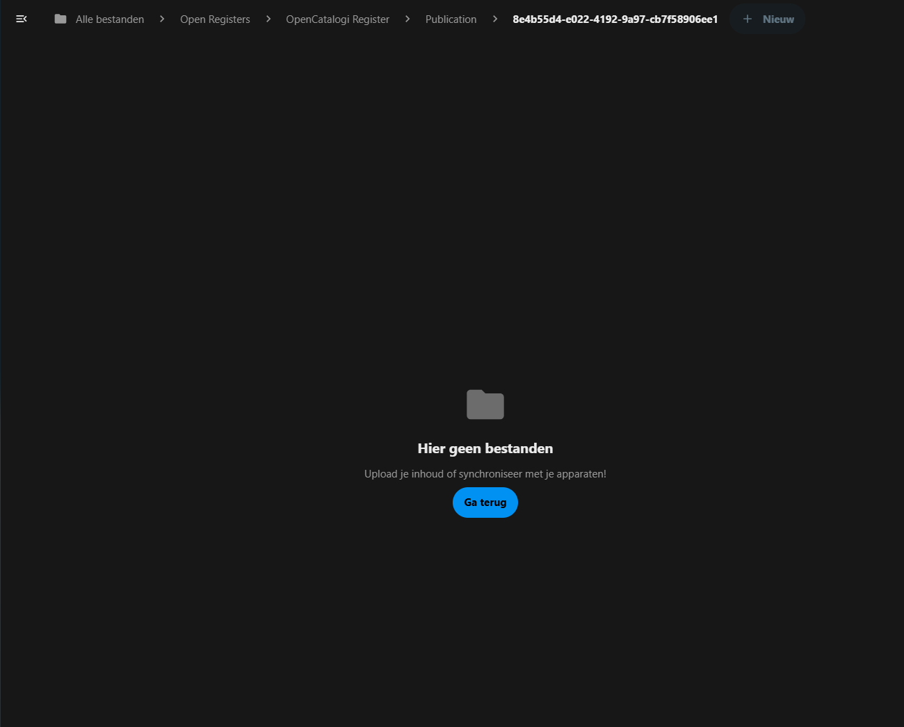

# File Attachments

File Attachments allow objects to include and manage associated files and documents.

## Overview

The file attachment system provides:
- Secure file storage
- Version control
- File metadata tracking
- Preview capabilities

## Key Benefits

1. **Document Management**
   - Centralized storage
   - Version tracking
   - Access control

2. **Integration**
   - Preview support
   - Search capabilities
   - Workflow integration

3. **Organization**
   - Structured storage
   - Metadata tracking
   - Relationship management

## **Setup**

[!NOTE] 
If you press the button 'view files' and a screen shows up that there are no files in the folder, while you actually have uploaded a file, you probably have not been added to the openregister share properly. Please check if you are in the openregister user group.

[!WARNING]
Under no circumstances you should add files in an Open Registers folder if the Open Registers is not shown in your file app natively. This would trigger that the file is created in your own user folder, making reconciling the shared folder and your user folder quite difficult.
## Related Features

- [Content Search](content-search.md) - Search file contents
- [Object Relations](object-relations.md) - Link files to objects 
